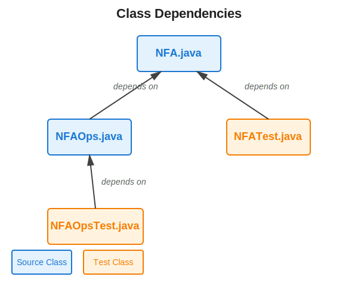

# Building and Packaging Software
## Apache Ant

---

# Learning Objectives

By the end of this session, you will:

- Understand the purpose and role of build automation tools
- Write Ant build files with targets and tasks
- Create compilation targets with dependency management
- Implement testing and packaging workflows
- Apply best practices for maintainable build scripts

---

# What is a Build System?

> **Build systems** automate the process of transforming source code into executable artifacts.

Common build tasks:
- Compiling source files into bytecode or binaries
- Running unit tests and generating reports
- Packaging compiled code into distributable formats (JARs, WARs)
- Managing dependencies between components
- Cleaning up generated files

**Why automate?** Consistency, reproducibility, efficiency, and reduced human error.

---

<!-- _class: compact -->

# Why Do We Need Build Tools?

<div class='cols'><div>

**Manual compilation becomes problematic:**

```bash
javac NFA.java
javac NFAOps.java
javac NFATest.java
java org.junit.runner.JUnitCore NFATest
jar cvf nfa-library.jar NFA.class NFAOps.class
```

**Problems:**
- Order matters
- Easy to forget steps
- Hard to reproduce on different machines
- No tracking of what needs recompilation

</div><div>



</div></div>

---

# Enter Apache Ant

**Ant** (Another Neat Tool) is a Java-based build automation tool.

**Key characteristics:**
- Uses XML to describe the build process
- Platform-independent (runs anywhere Java runs)
- Extensible with custom tasks
- Declarative approach: describe *what* to build, not *how*

**Released in 2000** as part of Apache Jakarta project, now a standalone Apache project.

---

# Ant vs. Other Build Tools

| Tool | Language | Style | Year |
|------|----------|-------|------|
| Make | Any | Makefile | 1976 |
| **Ant** | Java | XML | 2000 |
| Maven | Java | XML + Convention | 2004 |
| Gradle | JVM | Groovy/Kotlin DSL | 2012 |

**Ant's niche:** Explicit control, no imposed conventions, procedural build logic.

---

# Core Ant Concepts

Three fundamental building blocks:

1. **Project** - The container for all build logic (root element)
2. **Targets** - Named groups of tasks (like functions)
3. **Tasks** - Individual build actions (compile, copy, delete)

**Additionally:**
- **Properties** - Variables for reusable values
- **Dependencies** - Targets can depend on other targets

---

# Basic Build File Structure

Every Ant build file (`build.xml`):

```xml
<?xml version="1.0" encoding="UTF-8"?>
<project name="MyProject" default="compile" basedir=".">
    
    <!-- Properties go here -->
    
    <!-- Targets go here -->
    <target name="compile">
        <!-- Tasks go here -->
    </target>
    
</project>
```

**Convention:** Name the file `build.xml` in project root.

---

# Today's Demo: NFA Library

We'll build an Ant script for a finite automata library:

**Source files:**
- `NFA.java` - Core NFA class
- `NFAOps.java` - Operations on NFAs (depends on NFA)
- `NFATest.java` - JUnit tests for NFA

**Build progression:**
1. ✅ Compile NFA.java
2. ✅ Run NFATest.java unit tests
3. ✅ Compile NFAOps.java (with dependency)
4. ✅ Create JAR file

---

# Demo Part 1: Project Setup

Let's start with the project skeleton:

```xml
<?xml version="1.0" encoding="UTF-8"?>
<project name="NFALibrary" default="compile-nfa" basedir=".">
    
    <!-- Define directory structure -->
    <property name="src.dir" value="src"/>
    <property name="build.dir" value="build"/>
    <property name="classes.dir" value="${build.dir}/classes"/>
    
</project>
```

**Properties** act like variables - define once, reference everywhere with `${property.name}`.

---

# Demo Part 1: Compile NFA Target

Add our first target to compile `NFA.java`:

```xml
<target name="init">
    <echo>Creating build directories...</echo>
    <mkdir dir="${build.dir}"/>
</target>

<target name="compile-nfa" depends="init">
    <!-- Compile NFA.java -->
    <javac srcdir="${src.dir}" 
           destdir="${classes.dir}"
           includeantruntime="false">
        <include name="NFA.java"/>
    </javac>
</target>
```

**Run with:** `ant compile-nfa`

---

# Target Dependencies

**Dependency syntax:**
```xml
<target name="B" depends="A">
```

**Behavior:**
- Ant automatically runs target A before target B
- If A has already run in this session, it won't run again
- Can depend on multiple targets: `depends="A, B, C"`

**Dependency graph** ensures correct build order without manual intervention.

---

# Understanding the Compile Target

**Breaking down the tasks:**

- `<mkdir>` - Creates directory if it doesn't exist (idempotent)
- `<javac>` - Invokes Java compiler
  - `srcdir` - Where to find source files
  - `destdir` - Where to put compiled `.class` files
  - `includeantruntime="false"` - Don't include Ant's runtime in classpath
  - `<include>` - Which files to compile

**Why separate build directory?** Keeps source and compiled files organized.

---

# Active Learning: Predict the Output

**Question:** If you run `ant compile-nfa` twice in a row, what happens?

A) Second run fails with an error
B) Second run recompiles everything
C) Second run does nothing (up-to-date)
D) Build directory gets deleted and recreated

---

# Answer: Incremental Compilation

**Answer: B** - Ant recompiles everything in the basic `<javac>` task.

However, `<javac>` is **smart enough** to check timestamps:
- Compares source file modification time with class file
- Only recompiles if source is newer
- This is why build systems are faster than manual compilation

**To force full recompilation:** Delete the build directory first with a `clean` target.

---

# Demo Part 2: Testing Setup

Before testing, we need JUnit on the classpath:

```xml
<property name="lib.dir" value="lib"/>
<property name="junit.jar" value="${lib.dir}/junit-4.13.2.jar"/>

<path id="test.classpath">
    <pathelement location="${classes.dir}"/>
    <pathelement location="${junit.jar}"/>
</path>
```

**Path structures** define classpaths for compilation and execution.
- `<pathelement location="...">` - Adds a JAR or directory
- Referenced by `id` in other tasks

---

# Demo Part 2: Compile Test Target

Compile the test file:

```xml
<target name="compile-nfa-test" depends="compile-nfa">
    
    <javac srcdir="${src.dir}"
           destdir="${classes.dir}"
           includeantruntime="false">
        <include name="NFATest.java"/>
        <classpath refid="test.classpath"/>
    </javac>
    
</target>
```

**Key addition:** `depends="compile-nfa"` ensures NFA is compiled first!

---

# Demo Part 2: Run Tests Target

Execute the JUnit tests:

```xml
<target name="run-nfa-test" depends="compile-nfa-test">
    
    <junit printsummary="yes" haltonfailure="yes">
        <classpath refid="test.classpath"/>
        
        <test name="NFATest"/>
    </junit>
    
</target>
```

**JUnit task options:**
- `printsummary="yes"` - Show test results summary
- `haltonfailure="yes"` - Stop build if tests fail

---

# Active Learning: Dependency Chain

**Question:** When you run `ant run-nfa-test`, what is the order of execution?

Given these dependencies:
- `run-nfa-test` depends on `compile-nfa-test`
- `compile-nfa-test` depends on `compile-nfa`

---

# Answer: Dependency Resolution

**Execution order:**
1. `compile-nfa` (no dependencies)
2. `compile-nfa-test` (depends on compile-nfa)
3. `run-nfa-test` (depends on compile-test)

**Key insight:** Ant performs **topological sort** on the dependency graph!

This is the same problem we study with:
- Task scheduling
- Course prerequisites
- Build systems

**Acyclic dependencies only** - circular dependencies cause an error.

---

# Demo Part 3: Compile NFAOps

Now compile `NFAOps.java` which depends on `NFA.class`:

```xml
<target name="compile-nfa-ops" depends="compile-nfa">
    
    <javac srcdir="${src.dir}"
           destdir="${classes.dir}"
           includeantruntime="false">
        <include name="NFAOps.java"/>
    </javac>
    
</target>
```

**Dependency ensures compilation order** - NFA.class exists before NFAOps needs it.

---

# Why Dependencies Matter

**Without dependency management:**
```bash
$ javac NFAOps.java
NFAOps.java:10: error: cannot find symbol
    NFA automaton = new NFA();
    ^
  symbol:   class NFA
  location: class NFAOps
```

**With Ant dependencies:**
- Build system guarantees correct order
- No need to remember what depends on what
- Scales to hundreds of files

---

# Consolidating Compile Targets

One target for all source files:

```xml
<target name="compile" depends="compile-nfa, compile-ops">
    
    <javac srcdir="${src.dir}"
           destdir="${classes.dir}"
           includeantruntime="false">
        <include name="**/*.java"/>
        <exclude name="**/*Test.java"/>
    </javac>
    
</target>
```

**Glob patterns:** `**/*.java` means "all .java files in any subdirectory"

---

# Demo Part 4: Creating a JAR

Package compiled classes into a distributable JAR:

```xml
<target name="jar" depends="compile">
    
    <property name="dist.dir" value="dist"/>
    <mkdir dir="${dist.dir}"/>
    
    <jar destfile="${dist.dir}/nfa-library.jar"
         basedir="${classes.dir}">
        <include name="NFA.class"/>
        <include name="NFAOps.class"/>
    </jar>
    
</target>
```

**JAR** (Java Archive) bundles classes for distribution and deployment.

---

# JAR with Manifest

Add metadata to make the JAR executable:

```xml
<jar destfile="${dist.dir}/nfa-library.jar"
     basedir="${classes.dir}">
    <include name="NFA.class"/>
    <include name="NFAOps.class"/>
    
    <manifest>
        <attribute name="Built-By" value="${user.name}"/>
        <attribute name="Implementation-Version" value="1.0"/>
    </manifest>
</jar>
```

**Manifest** contains metadata about the JAR (version, main class, etc.).

---

# Active Learning: Build a Complete Target

**Exercise:** Create a target called `all` that:
1. Compiles all source files
2. Runs the tests
3. Creates the JAR

**What should the `depends` attribute be?**

---

# Solution: The "All" Target

```xml
<target name="all" depends="test, jar"
        description="Build and test everything">
    
    <echo message="Build complete! JAR created."/>
    
</target>
```

**That's it!** Dependencies handle the rest:
- `test` → `compile-test` → `compile-nfa`
- `jar` → `compile`
- Ant runs each target only once

**Echo task** prints messages during build (useful for debugging).

---

# The Clean Target

Always include a way to start fresh:

```xml
<target name="clean" description="Delete generated files">
    
    <delete dir="${build.dir}"/>
    <delete dir="${dist.dir}"/>
    
    <echo message="Cleaned build and dist directories"/>
    
</target>
```

**Common pattern:** `ant clean all` rebuilds from scratch.

**Why needed?** Sometimes incremental builds get out of sync.

---

# Complete Build File Structure

```xml
<project name="NFALibrary" default="all" basedir=".">
    
    <!-- Properties -->
    <property name="src.dir" value="src"/>
    <property name="build.dir" value="build"/>
    ...
    
    <!-- Classpath definitions -->
    <path id="test.classpath">...</path>
    
    <!-- Targets -->
    <target name="compile-nfa">...</target>
    <target name="compile-test" depends="compile-nfa">...</target>
    <target name="test" depends="compile-test">...</target>
    <target name="compile" depends="compile-nfa, compile-ops">...</target>
    <target name="jar" depends="compile">...</target>
    <target name="all" depends="test, jar">...</target>
    <target name="clean">...</target>
    
</project>
```

---

# Running Ant

**Command line syntax:**
```bash
ant [options] [target [target2 [target3] ...]]
```

**Common commands:**
- `ant` - Runs the default target
- `ant compile` - Runs specific target
- `ant clean all` - Runs multiple targets in order
- `ant -projecthelp` - Lists all targets with descriptions
- `ant -verbose` - Shows detailed output

**Default target** specified in `<project default="...">`.

---

# Best Practices

**1. Use properties for paths**
- Easier to maintain
- Can override from command line: `ant -Dsrc.dir=source compile`

**2. Add descriptions to targets**
- Shows up in `-projecthelp`
- Documents purpose

**3. Separate compilation from testing**
- Tests shouldn't always run during development
- But run before commits!

---

# Best Practices (continued)

**4. Use dependencies, not sequential targets**
- Let Ant manage order
- More maintainable

**5. Include a clean target**
- Fresh builds catch dependency issues

**6. Make builds reproducible**
- Don't depend on environment variables without defaults
- Document required tools and versions

---

# Active Learning: Debug This Build

**What's wrong with this target?**

```xml
<target name="broken-test" depends="compile">
    <junit printsummary="yes">
        <test name="NFATest"/>
    </junit>
</target>
```

**Hint:** Think about what JUnit needs to run tests.

---

# Answer: Missing Classpath

**Problem:** No classpath specified!

**Fixed version:**
```xml
<target name="working-test" depends="compile-test">
    <junit printsummary="yes" haltonfailure="yes">
        <classpath refid="test.classpath"/>
        <test name="NFATest"/>
    </junit>
</target>
```

**Also needed:**
- Changed dependency to `compile-test` (needs test classes)
- Added `classpath` reference

---

# Ant in the Real World

**Where Ant is still used:**
- Legacy Java projects (especially pre-2010 code)
- Projects requiring fine-grained control
- Custom build processes that don't fit conventions

**Modern alternatives:**
- **Maven** - Convention over configuration, dependency management
- **Gradle** - Flexible, powerful, uses Groovy/Kotlin DSL
- **Make** - Still common for C/C++ projects

**Key insight:** All build tools solve the same problem with different tradeoffs.

---

# Ant vs. Maven vs. Gradle

| Aspect | Ant | Maven | Gradle |
|--------|-----|-------|--------|
| **Config** | XML | XML + POM | Groovy/Kotlin |
| **Philosophy** | Procedural | Declarative | Both |
| **Dependencies** | Manual | Automatic | Automatic |
| **Flexibility** | Very high | Low | High |
| **Learning Curve** | Medium | Medium-High | High |

**Choose Ant when:** You need complete control and have unusual build requirements.

---

# Beyond Compilation

Ant can automate many tasks:

- **Documentation:** Generate Javadoc
- **Deployment:** Copy files to servers
- **Code quality:** Run checkstyle, PMD, FindBugs
- **Database:** Run SQL scripts, migrations
- **Integration:** Trigger external tools
- **Custom tasks:** Write your own in Java

**Extensibility** is one of Ant's strengths.

---

# Example: Documentation Target

```xml
<target name="javadoc" depends="compile"
        description="Generate API documentation">
    
    <property name="doc.dir" value="docs"/>
    <mkdir dir="${doc.dir}"/>
    
    <javadoc sourcepath="${src.dir}"
             destdir="${doc.dir}"
             packagenames="*"
             author="true"
             version="true"
             use="true"
             windowtitle="NFA Library API">
        <classpath refid="test.classpath"/>
    </javadoc>
    
</target>
```

---

# Next Steps

**To practice:**
1. Convert your current project to use Ant
2. Add targets incrementally (compile, test, package)
3. Experiment with different tasks (copy, delete, zip)

**To learn more:**
- Apache Ant Manual: https://ant.apache.org/manual/
- Compare with Maven/Gradle for your next project
- Study dependency management in larger projects

**Remember:** The best build tool is the one that fits your project's needs!

---

# Questions?

**Today we covered:**
- Build system fundamentals
- Ant project structure (project, targets, tasks)
- Dependency management
- Progressive demo: compile → test → package
- Best practices

**What questions do you have?**

---
