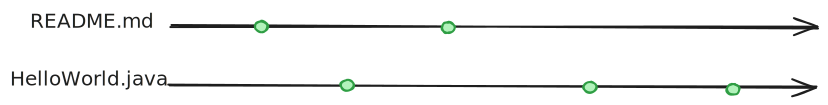
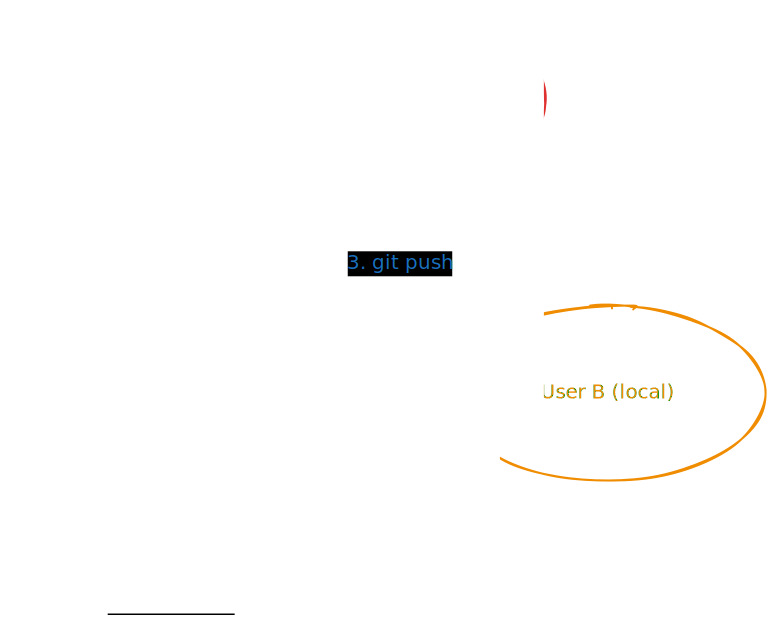
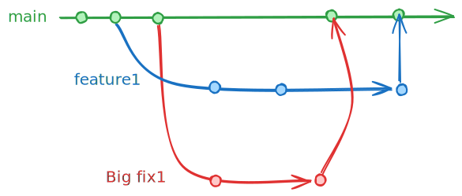

# Git: Version Control System

## Learning Objectives

- Understand what a Version Control System (VCS) is
- Learn the core Git workflow
- Master basic Git commands
- Understand branching concepts

---

# What is Git?

- **A popular Version Control System (VCS)**
- Powers GitHub, GitLab, Bitbucket
- Industry standard for code management

## 🤔 Quick Check
*Think of a time you wished you could go back to an earlier version of your work...*

---

# Version Control: The Concept

## You've Already Used Version Control!

- Google Drive revision history
- OneDrive version tracking
- Track Changes in Word



---

# VCS: Beyond Single Files

## Traditional Approach
- Multiple versions of individual files
- Manual naming conventions (final_v2_REALLY_final.doc)

## VCS Approach
- Manages versions of **entire file sets**
- Each **commit** = snapshot of all files
- Organized version history

---

# How VCS Works


**Key concept:** When you change files and *commit*, ALL changes are versioned together

---

# 🎯 Active Learning: Think-Pair-Share

## Individual (1 min)
List 2 problems you've had managing files without version control

## Pair (2 min)
Share with a neighbor and find commonalities

## Share (2 min)
Let's hear some examples!

---

# Why Use Version Control?

## Common Misconception
*"VCS is just for teams"* ❌

## Reality
Benefits for **everyone**, not just teams! ✅

---

# Single User Benefits

- 🔄 **Revert** to previous versions when things break
- 🌿 **Create branches** to experiment safely
- 📝 **Document changes** with commit messages
- 🕰️ **Time travel** through your project history

---

# Team Collaboration Benefits

- 👥 **Parallel development** without conflicts
- 🔍 **Track changes** by person
  - Accountability
  - Troubleshooting
- 👀 **Code reviews** before merging
- 🔐 **Access control** for security

---

# Core Git Workflow



---

# The Four Essential Commands

1. **`git clone`** - Copy remote repo to local
2. **`git commit`** - Save changes locally
3. **`git push`** - Send changes to remote
4. **`git pull`** - Get changes from remote

*We'll use command line first, then IDE integrations later*

---

# 📚 Reference Material

## Git Cheat Sheet
https://education.github.com/git-cheat-sheet-education.pdf

*Keep this handy during exercises!*

---

# Step 1: Verify Git Installation

```bash
git --version
```

Expected output:
```
git version 2.x.x
```

⚠️ If not installed: https://git-scm.com/

---

# Step 2: Clone a Repository

```bash
# Set up variables
export REPOS_DIR="github"
export REMOTE_REPO="https://github.com/username/repo.git"
export REPO_NAME="hello-git"

# Create directory and clone
mkdir $REPOS_DIR
cd $REPOS_DIR
git clone $REMOTE_REPO
cd $REPO_NAME
```

---

# Getting the Repository URL

1. Go to the GitHub repository
2. Click the green **"Code"** button
3. Copy the URL (HTTPS or SSH)

💡 **Tip:** Private repos require authentication

---

# Step 3-4: Make Changes & Check Status

## Make your changes
Edit files using your favorite editor

## Check what changed
```bash
git status
```

Shows:
- Modified files (red)
- Staged files (green)
- Untracked files

---

# Step 5: Stage Files for Commit

## Three staging options:

```bash
# Option 1: Specific files
git add filename.txt

# Option 2: All modified/deleted files
git add .

# Option 3: All new/modified/deleted files
git add -A
```

---

# 🎯 Active Learning: Staging Practice

## Scenario
You've modified 3 files:
- `main.py` - ready to commit
- `test.py` - still debugging
- `README.md` - ready to commit

**Question:** Which command stages only the ready files?

*Think for 30 seconds, then discuss*

---

# Step 6: Commit Your Changes

```bash
git commit -m "Add feature X"
```

## Good Commit Messages:
- ✅ "Fix login bug for special characters"
- ✅ "Add user authentication feature"
- ❌ "Fixed stuff"
- ❌ "asdfasdf"

⚠️ **Remember:** Commits are LOCAL only!

---

# Step 7-8: Push to Remote

```bash
git push
```

Then verify on GitHub:
- Check commit history
- Review file changes
- Confirm push succeeded

---

# 🎯 Checkpoint Activity

## Quick Quiz (Response Cards)

**True or False:**
1. After `git commit`, changes are on GitHub
2. `git add .` stages all new files
3. Commit messages don't matter
4. You need internet for `git commit`

---

# Branching: Parallel Development

## What is a Branch?
- Independent line of development
- Isolated from other branches
- Can be merged back when ready

---

# Why Use Branches?

- 🚀 **Feature Development** - Work without breaking main
- 🧪 **Experimentation** - Try ideas safely
- 🐛 **Bug Fixes** - Isolate fixes from features
- 📦 **Release Management** - Stable deployment branches

---

# Branching Visualization



---

# Essential Branch Commands

```bash
# Switch to main branch
git checkout main

# Create and switch to new branch
git checkout -b feature1

# Switch between existing branches
git checkout branch-name

# Merge branch into current branch
git merge feature1

# Delete branch
git branch -d feature1
```

---

# Branching Workflow Example

## Scenario: Feature + Urgent Bug Fix

1. Working on `feature1` branch
2. Critical bug reported on production
3. Need to fix without including incomplete feature

---

# Workflow Implementation

```bash
# Start feature work
git checkout -b feature1
# ... work on feature ...

# Emergency! Switch to fix bug
git checkout main
git checkout -b bugfix1
# ... fix bug ...
git commit -m "Fix critical login bug"

# Merge fix to main
git checkout main
git merge bugfix1
git branch -d bugfix1
git push
```

---

# Continue Feature Work

```bash
# Resume feature development
git checkout feature1
# ... finish feature ...
git commit -m "Complete user dashboard feature"

# Merge feature when ready
git checkout main
git merge feature1
git branch -d feature1
git push
```

---

# 🎯 Group Exercise: Branch Simulation

## Teams of 3-4

**Scenario:** You're developing a website

**Roles:**
- Developer A: Navigation feature
- Developer B: Footer update
- Developer C: Emergency typo fix

**Task:** Write the Git commands each developer uses

*5 minutes to plan, 2 minutes to present*

---

# Key Reminders

## Local vs Remote

- **Commits** are LOCAL until pushed
- **Branches** are LOCAL until pushed
- Always `git push` to share with team
- Use `git pull` to get team changes

---

# Common Pitfalls to Avoid

1. 🚫 Forgetting to push after commit
2. 🚫 Working directly on main branch
3. 🚫 Vague commit messages
4. 🚫 Not pulling before starting work
5. 🚫 Committing sensitive data (passwords)

---

