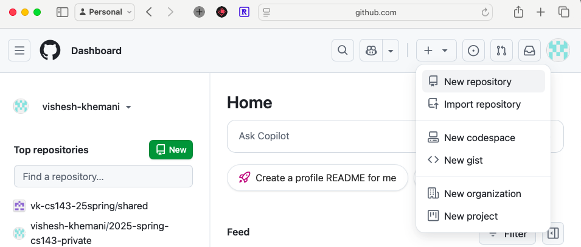

<!-- _class: lead -->

# Introduction to GitHub
## Your Gateway to Collaborative Coding

🚀 Let's explore the world's largest code hosting platform!

---

# What is GitHub?

## 🌐 Web-based platform that hosts Git repositories

**GitHub.com** - Where code lives and grows

### Three Key Concepts:

1. **Git** - Version Control System
2. **Repository** - Project Storage
3. **Collaboration** - Working Together

---

# Understanding the Components

## Git: The Foundation

> **Version Control System (VCS)** that tracks changes in your files

### What does Git do?
- 📝 Records history of changes
- 👥 Enables collaboration
- 🔄 Allows reverting to previous versions
- 🌳 Manages different versions (branches)

*Think of it as "Google Docs version history", on steroids, for code!* (more on this later)

---

# Repository (Repo): Your Project's Home

## 📦 A storage space for your project files

### What's in a repository?
- **Code files** (.py, .java, .js, etc.)
- **Documentation** (README, guides)
- **Media** (images, videos)
- **Configuration** files
- **History** of all changes

---

### Example
```
my-project/
├── README.md
├── src/
│   └── main.py
├── docs/
└── images/
```

---

# Why Use GitHub?


| Benefit             | Description                      | Real-World Impact            |
| :------------------ | :------------------------------- | :--------------------------- |
| **Share Code**      | Make projects publicly available | Open source contributions    |
| **Collaborate**     | Work with teams worldwide        | Linux, React, TensorFlow     |
| **Manage Projects** | Track issues, plan features      | Professional development     |
| **Build Portfolio** | Showcase your work               | Job applications, interviews |

---

# GitHub in the Real World

<div class="cols">

<div>

### Major Projects Hosted on GitHub:
- **Linux Kernel** - Operating system powering servers worldwide
- **React** - Facebook's UI library
- **TensorFlow** - Google's machine learning framework
- **VS Code** - Microsoft's popular editor
- **Bitcoin** - Cryptocurrency implementation

</div>

<div>

### Your Projects:
- Class assignments
- Personal projects
- Hackathon submissions
- Research code

</div>

</div>

---

<!-- _class: lead -->

# Activity 1: Create Your Account
## Let's get you started! 🚀

---

# Creating Your GitHub Account

## Step-by-Step Guide

### 1. Navigate to github.com
### 2. Click "Sign up"
### 3. Choose:
   - **Username** (choose wisely - this is your identity!)
   - **Email** (use your .edu for student benefits)
   - **Password** (strong and unique)

### 4. Verify your account

💡 **Pro Tip:** Your username becomes part of your URL: `github.com/YOUR_USERNAME`

---

<!-- _class: compact -->

# 🎓 GitHub Student Developer Pack

## Free tools worth $$$

### Benefits Include:
- **GitHub Pro** - Unlimited private repos
- **Copilot** - AI pair programmer
- **Cloud Credits** - AWS, Azure, DigitalOcean
- **Development Tools** - JetBrains, GitKraken
- **Learning Resources** - Courses and tutorials

### How to Apply:
1. Go to: `education.github.com/pack`
2. Click "Get your pack"
3. Verify with your .edu email
4. Upload student ID or enrollment proof

*Don't skip this - it's incredibly valuable!*

---

<!-- _class: lead -->

# Activity 2: Create Your First Repository
## Time to build something! 🔨

---

# Creating a Repository



## Steps to Create:

1. Click **+** button (top right)
2. Select **"New repository"**
3. Configure:
   - **Name**: `hello-git`
   - **Description**: Optional
   - ✅ **Add README file**
   - **Public** vs Private
4. Click **"Create repository"**

---

# Repository Settings Explained

## Key Configuration Options

| Setting            | What it means         | Recommendation             |
| :----------------- | :-------------------- | :------------------------- |
| **Name**           | Repository identifier | Use lowercase with hyphens |
| **Description**    | Brief explanation     | Always add one!            |
| **Public/Private** | Visibility            | Public for portfolio       |
| **README**         | Project documentation | Always include             |
| **License**        | Usage rights          | MIT for open source        |
| **.gitignore**     | Files to exclude      | Match your language        |

---

<!-- _class: compact -->

# Understanding README Files

## 📄 The Front Page of Your Project

### What to Include:
```markdown
# Project Name
Brief description of what this project does

## Installation
How to set up the project

## Usage
How to use the project

## Contributing
How others can contribute

## License
What license applies
```

**Uses Markdown format** - Simple, readable, powerful!

---

<!-- _class: lead -->

# Activity 3: Make Your First Commit
## Let's modify some files! ✏️

---

<!-- _class: compact -->

# Making Changes: The Commit Process

## What is a Commit?

> A **commit** is a snapshot of your changes with a descriptive message

### Think of it as:
- 📸 A "save point" in a video game
- 📝 A journal entry of what you changed
- ⏰ A timestamp in your project's history

### Components:
1. **Changes** - What was modified
2. **Message** - Why it was changed
3. **Author** - Who made the change
4. **Timestamp** - When it happened

---

# Hands-On: Edit Your README

## Steps to Edit and Commit

### 1. Click the ✏️ pencil icon on README.md

### 2. Add content using Markdown:
```markdown
# Hello Git! 👋

This is my first GitHub repository!

## About Me
- ...
```

---

# Committing Your Changes

## The Commit Dialog

### 3. Click "Commit changes..."

### 4. Write a meaningful commit message:
```
Add personal introduction to README

- Added about me section
- ...
```

### 5. Select: "Commit directly to main branch"

### 6. Click "Commit changes"

---

<!-- _class: compact -->
# Viewing History

## 🕐 See Your Project's Timeline

### Click the history icon (clock with arrow) to see:

- **All commits** made to the file
- **Who** made each change
- **When** changes were made
- **What** was changed (diff view)

### Why History Matters:
- Debug when things broke
- Understand project evolution
- Give credit to contributors
- Revert problematic changes

---

# Good vs Bad Commit Messages

| Scenario      | ❌ Bad         | ✅ Good                                                     |
| :------------ | :------------ | :--------------------------------------------------------- |
| Bug fix       | "fixed stuff" | "Fix crash on submit button when form is empty"            |
| New feature   | "update"      | "Add CSV export functionality to data table"               |
| Documentation | "docs"        | "Update README with installation instructions for Windows" |

### Best Practices:
- **Start with a verb** (Add, Fix, Update, Remove)
- **Be specific** about what changed
- **Keep it concise** (50 chars for title)
- **Add details** in description if needed

---

# GitHub Workflow Summary

## The Basic Cycle

```
1. Create/Clone Repository
        ↓
2. Make Changes (Edit files)
        ↓
3. Commit Changes (Save snapshot locally)
        ↓
4. Push to GitHub (Save snapshot in GitHub)
        ↓
5. Repeat!
```

This is the foundation of all Git workflows!

---

# Beyond the Basics

## What's Next?

<div class="cols">

<div>

### GitHub Features to Explore:
- **Branches** - Work on features separately
- **Pull Requests** - Propose changes
- **Issues** - Track bugs and features
- **Actions** - Automate workflows
- **Pages** - Host websites for free
</div>
<div>

### Git Command Line:
- `git clone` - Copy repo locally
- `git add` - Stage changes
- `git commit` - Save changes
- `git push` - Upload to GitHub
- `git pull` - Download updates

</div>
</div>

---

# Real-World GitHub Tips

## 🏆 Pro Strategies

<div class="cols">

<div>

### For Your Profile:
1. **Pin** your best repositories
2. Add a **profile README** (special repo)
3. **Contribute** regularly (green squares!)
4. **Star** interesting projects
5. **Follow** developers you admire

</div>
<div>

### For Your Projects:
1. Always include **README**
2. Add **screenshots** for visual projects
3. Use **descriptive** commit messages
4. **License** your work appropriately
5. Respond to **issues** promptly

</div>
</div>

---

# Common Pitfalls to Avoid

## ⚠️ Learn from Others' Mistakes

| Mistake              | Consequence         | Prevention                            |
| :------------------- | :------------------ | :------------------------------------ |
| Committing passwords | Security breach     | Use .gitignore, environment variables |
| Huge files (>100MB)  | Repo becomes slow   | Use Git LFS or external storage       |
| "Fix bug" messages   | Can't track changes | Be descriptive                        |
| Not using branches   | Messy history       | Branch for features                   |
| Forgetting to pull   | Merge conflicts     | Always pull before push               |

---

<!-- _class: compact -->

# Resources for Learning More

## 📚 Continue Your Journey

### Official Resources:
- **GitHub Docs**: docs.github.com
- **GitHub Learning Lab**: lab.github.com
- **Pro Git Book**: git-scm.com/book (free!)

### Interactive Tutorials:
- **GitHub Skills**: skills.github.com
- **Learn Git Branching**: learngitbranching.js.org
- **Atlassian Git Tutorial**: atlassian.com/git


### Practice:
- **First Contributions**: firstcontributions.github.io
- **Good First Issues**: goodfirstissues.com

---

