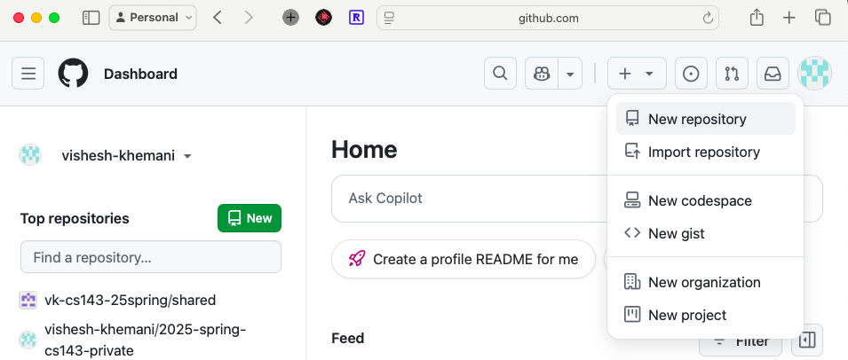

# GitHub

- https://github.com
- What is it?
  - Web-based platform that hosts Git repositories
    - **Git**: a popular **version control system (VCS)**
      - We'll see it in more detail later
    - **Repository** **(repo)**: a store of related files (code, text, media, etc.) typically associated with a project
      - e.g. the repo for this class's lecture notes
- Why use it?
  - Share your code/content
  - Collaborate with others
  - Manage projects
  - Showcase your portfolio

## Activity: Create Account

1. If you don't have a GitHub account, create one for free
   1. Just follow the signup steps on the website
2. Recommended: apply for the free GitHub Student Developer Pack
   1. https://education.github.com/pack

## Activity: Create Repo

1. Log in to github.com
2. Click on the + button in the top right and select **New repository**
3. Configure your new repo
   1. Name e.g. `hello-git`
   2. Select *Add a README file*
   3. You can leave the other options set to their defaults
4. Click **Create repository**

## Activity: Commit Changes

1. Click on the pencil icon to modify the README file to contain some content
   1. Use [markdown](https://docs.github.com/en/get-started/writing-on-github/getting-started-with-writing-and-formatting-on-github/basic-writing-and-formatting-syntax)
2. Click on *Commit changes...*
3. Update the commit message if you'd like
4. Leave the default selection of *Commit directly to the main branch*
5. Click on *Commit changes*
6. Click on "clock with arrow" icon (aka history or recent activity) to see the commit history of the README file