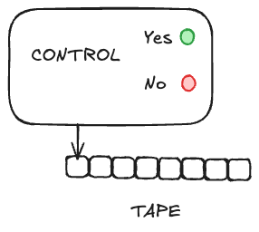

# Automata

> What is a computer?

## In Practice

## In Theory

> An **automaton** or an **abstract machine** or a **computational model**

- We don't care how such a theoretical computer is realized in the real world 

### Components and capabilities

1. Tape
   - Contains the input string for the computation
2. Control
   - Processes symbols from the tape one at a time
   - Varying capabilities
      - Read-only
      - Read-write
      - Scan-right only
      - Scan in both directions
3. Output
   - Yes/No indicating the answer to a **decision** problem
   - If tape-write capability, output string on a designated portion of the tape as answer to a **function** problem (input -> output)

### Why abstract machines?

Why this gulf between a theoretical computer and your computer?

- To distill a computer down to its essentials so that we can explore questions like
  - What are the capabilities and limitations of computers?
  - Are some computers fundamentally more powerful than others?
  - Are there problems a computer cannot solve, no matter how much technology advances?
  - Are there solveable problems that are impractical to solve in a reasonable amount of time, no matter how much technology advances?
  - ...

## Specific Automata
Of all conceivable automata, we'll focus on the following:

1. **Finite Automata**
   1. **Deterministic (DFA)**
   2. **Nondeterministic (NFA)**
2. **Turing Machines (TM)**

There are good reasons to focus on the above atomata, and those will become clear when we examine them.