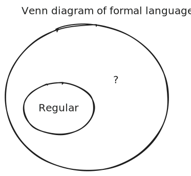

<!-- _class: lead -->

# Beyond Regular Languages

## Exploring the Limits of Finite Automata

---

# What We Know So Far

**Kleene's Theorem:** Three equivalent models for regular languages

1. **Regular Expressions** - Specification
2. **DFAs** - Deterministic recognition
3. **NFAs** - Nondeterministic recognition

**Question:** Are there languages that are NOT regular?

---

# The Central Question

> Can we find languages that cannot be:
> - Specified by any regular expression?
> - Recognized by any DFA or NFA?

**Answer:** YES! Let's see an example...

---

# Example: Equal 0s and 1s

**Language Definition:**
$L = \{0^n1^n \mid n \geq 0\}$

**In the language:**
- ε (empty string)
- 01
- 0011
- 000111
- 00001111

**Not in the language:**
- 0
- 001
- 0111
- 1100

---

# Why This Language Is Not Regular

**Intuitive Argument:**

To recognize $0^n1^n$, we need to:
1. Count the number of 0s
2. Then verify we have exactly the same number of 1s

**The Problem:**
- Need one state for each possible count of 0s
- But n is **unbounded** (can be any positive integer)
- Therefore need **infinite** states
- But DFAs/NFAs must have **finite** states!

---

---

# Key Insight

> **There exist formal languages that are NOT regular languages**

This is a fundamental limitation of finite automata!

**Implications:**
- Regular expressions cannot describe all languages
- DFAs and NFAs are limited in power
- We need more powerful computational models

---

# The Language Hierarchy

**Regular languages** are just one class in a larger hierarchy

---

# More Powerful Machines

To recognize non-regular languages, we need enhanced computational models:

1. **Pushdown Automata (PDA)**
2. **Linear Bounded Automata (LBA)**
3. **Turing Machines (TM)**

Each adds more capability than the previous one

---

# Pushdown Automata (PDA)

**Enhancement:** Add a **stack** to a DFA

### What is a Stack?
- LIFO (Last In, First Out)
- Can push symbols
- Can pop symbols
- Unbounded capacity

### How It Helps
- Count 0s by pushing
- Match 1s by popping
- Accept when stack empty

**Recognizes:** Context Free Languages (CFLs)

---

# Context Free Languages (CFLs)

**Definition:** Languages recognized by PDAs

**Examples:**
- $0^n1^n$ (equal 0s followed by 1s)
- Balanced parentheses
- Programming language syntax (mostly)
- Arithmetic expressions

**Key Property:** All regular languages are CFLs, but not all CFLs are regular

---

---

# Turtles All The Way Down?

> Are we doomed to an endless sequence of increasingly powerful machines?

**Answer:** NO!

There exists a **pinnacle** of abstract machines:
- **Turing Machines** and equivalent models
- Called **Turing complete** or **Turing universal**
- As powerful as any possible machine
- We'll study these next!

---

# Complete Language Hierarchy

---

# Language Hierarchy Table

| Language Type  | Specification        | Recognition               |
|:---------------|:---------------------|:--------------------------|
| Regular        | Regular Expression   | NFA/DFA                   |
| Context Free   | Context Free Grammar | PDA (DFA + stack)         |
| Decidable      | Set description      | Turing Machine            |
| Recognizable   | Set description      | Turing Machine            |
| Unrecognizable | Set description      | **No machine possible!**  |

---

# Why This Matters

**Practical Implications:**

- **Compiler Design:** Programming language syntax is (mostly) context-free
- **Pattern Matching:** Know when regex won't work
- **Algorithm Design:** Understand what's computable vs. what's not
- **Complexity Theory:** Some solvable problems are intractable

**Theoretical Foundation:** Understanding limits is crucial for computer science

---

# Optional Deep Dives

Want to explore further?

1. **Context Free Languages** - Study CFGs and PDAs in detail
2. **Context Sensitive Languages** - Examine CSGs and LBAs
3. **Pumping Lemma** - Formal proof technique for non-regularity

See the course notes for some coverage of these topics

---

