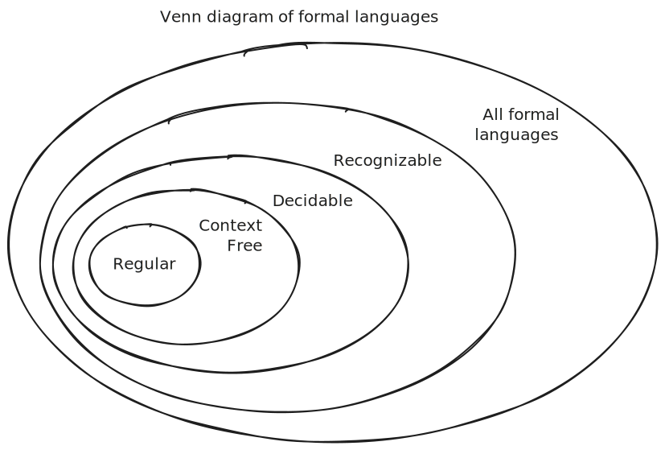

# Beyond Regular Languages

- REs, DFAs, NFAs are equivalent models for describing a set of formal languages called regular languages (Kleene's Theorem)
- Are there languages that are not regular?
  - i.e. can't be specified by an RE or recognized by an NFA/DFA?

## Example

- Consider the language of **all binary strings with an equal number of 0s followed by 1s**
  - L = {$0^n1^n$ | $n \ge 0$}

- Can you construct an RE or a DFA/NFA for this language?
- No!
- Why?
  - To count the number of 0s we'd need as many states as there are 0s
  - But the number of 0s is unbounded
  - So the number of states is unbounded
  - So can't have a finite number of states

> > [!IMPORTANT]
> >
> > There exist formal languages that are not regular languages.

## More Powerful Machines

- Clearly finite automata are not powerful enough to recognize even seemingly simple languages like the example above
- Nonregular languages require **more powerful abstract machines** to recognize them
  1. Pushdown Automata (PDA) 
     1. Add a stack to a DFA
     2. Recognizes the class of "[context free languages (CFLs)](cfl.md)"
        1. Contain all regular languages
        2. Also contain the example nonregular language above
  2. ...
- Are we doomed to an endless sequence of conceiving of more powerful abstract machines to recognize more formal languages?
- No!
- There is a **pinnacle of abstract machines**: a class of abstract machines, all equivalent to one another, that are as powerful as any possible machine
  - Such machines are called **Turing complete** or **Turing universal**
  - We'll examine these in the next section

- Can such machines recognize all possible formal languages?
- No!
- Some languages cannot be recognized by any machine
  - We'll examine this later

## Language Hierarchy

Here's a sneak peek at the Venn diagram of formal languages:

| Language Type  | Specification        | Deciding/Recognition      |
| -------------- | -------------------- | ------------------------- |
| Regular        | Regular Expression   | NFA or equivalent DFA     |
| Context Free   | Context Free Grammar | PDA (DFA with stack)      |
| Decidable      | Set description      | Turing-complete Machine   |
| Recognizable   | Set description      | Turing-complete Machine   |
| Unrecognizable | Set description      | No such machine possible! |

