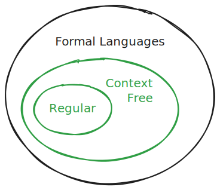

# Context Free Languages (CFLs)

- NFAs and DFAs are quite powerful
- Now let's understand their limitiations
- Are there languages that can't be recognized by them?
- In other words, are some formal languages not regular languages?

## Example

- Consider the language of **all binary strings with an equal number of 0s followed by 1s**
- Can you construct an RE or a DFA/NFA for this language?
- No!
- Why?
  - To count the number of 0s we'd need as many states as there are 0s
  - But the number of 0s is unbounded
  - So the number of states is unbounded
  - So can't have a finite number of states

> There exist formal languages that are not regular languages.

## Context Free Grammar (CFG)

- A regular language is specified by a regular expression
- How is a CFL specified?
-  By a **context free grammar (CFG)**
- What's a CFG?
  - A set of production rules that describe how strings in the language can be generated
  - Components of a CFG:
    - Terminals: alphabet symbols
    - Variables (non-terminals): symbols that can be replaced by groups of terminals
      - Typically denoted by uppercase letters
    - Production rules: how variables can be replaced by variables and/or terminals
      - $A \rightarrow \alpha$ where $A$ is a variable and $\alpha$ is a string of variables and/or terminals
    - Start symbol: a special variable from which the generation of strings begins, usually denoted as S
- Example of a CFG over the binary alphabet {0, 1}:

  - Production rules
    1. $S \rightarrow \epsilon$
    2. $S \rightarrow 0S1$
  - The 2nd rule generates strings with an equal number of 0s followed by 1s
  - The 1st rule allows for the empty string to be in the language
  - So this grammar defines the nonregular language we saw above: **all binary strings with an equal number of 0s followed by 1s**
  - Derive 000111
    - S -> 0S1 -> 00S11 -> 000S111 -> 000111

## Pushdown Automata (PDA)

- A regular language is recognized by an NFA

- How is a CFL recognized?

- By a **Pushdown Automata (PDA)**

- What's that?

  - NFA with an unbounded stack (LIFO)

  - Example PDA for equal 0s followed by 1s
    - Read symbols
    - As each 0 is read, push on to stack
    - As each 1 is read, pop from the stack
    - If input finishes exactly when stack is empty, accept

## Regular vs CFL

- **All regular languages are context free languages** (but not vice versa of course)
- Why?
  1. Automata: NFA is just a PDA with the stack not used
  2. Grammar:
     1. The state transition q0 -> q1 on 'a' gives the production rule q0 -> a q1
     2. Each accept state gives the production rule q -> $\epsilon$
     3. Example
        1. The regular language of even 0s in a binary string has the CFG:
           1. S -> 0A
           2. S -> 1S
           3. S -> $\epsilon$
           4. A -> 0S
           5. A -> 1A
        2. Derive 110101
           1. S -> 1S -> 11S -> 110A -> 1101A -> 11010S -> 110101S -> 110101
- Uses
  - syntax of programming languages
  - ...

## Language Hierarchy

| Language Type | Specification        | Recognition          |
| ------------- | -------------------- | -------------------- |
| Regular       | Regular Expression   | NFA                  |
| Context Free  | Context Free Grammar | PDA (NFA with stack) |

