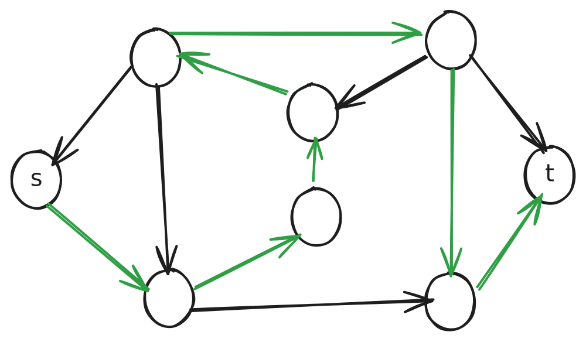

# The Class NP

- We saw in [the class P](class-p.md) that there are problems in which we can avoid exponential time brute-force search  and devise polynomial time solutions
  - e.g. is there a path in a directed graph between two nodes
- However, there are problems, useful ones, for which no one has yet discovered a polynomial time algorithm
- Why not? No one knows.
  - Maybe humans haven't discovered some mathematical principles which would make those problems tractable
  - Or maybe such problems are intrinsically intractable

## The Hamiltonian Path Problem

- An example of such a problem from graphs

> A **Hamiltonian path** in a directed graph G is a path that goes through each node exactly one

Intuitive problem statement:

> Given a directed graph G and two vertices s, t, determine whether it has a Hamiltonian path from s to t

Formal problem statement:

> HAMPATH = {\<G, s, t\> | G is a directed graph with a Hamiltonian path from s to t}

- Also known as the **traveling salesman problem**

### Exponential Time Solution

- Based on the abandoned brute-force search idea to solve PATH
  - Consider all potential paths in G that start at s and and at t: $O(m^{m-2})$ where $m$ is the number of nodes
  - If a path exists that begins at s, ends at t, and visits every other node in between, then return true
  - Otherwise return false

### Polynomial Time Verification

- Even if we can't determine if a Hamiltonian path exists, if someone gave us such a path, we could easily verify whether it is Hamiltonian in polynomial time
- How?
  - Simply check that each edge in the provided path is an edge in the graph

> A **verifier** for a language, say HAMPTATH, is an algorithm V, where
>
> HAMPATH = {\<G, s, t\> | V accepts <G, s, t, p\> for some Hamiltonian path p}

- The information $p$ in the above definition is called a **certificate** or **proof** of membership in HAMPATH

> [!IMPORTANT]
>
> Definition 1: **NP** is the class of languages that have polynomial time verifiers

- What are some everyday problems that are not easy to solve, but once you solve them it's easy to verify that the solution is correct?
  - Puzzles!
    - Sudoku, KenKen, Crossword, Jigsaw...

### Nondeterministic Polynomial Time Solution

- HAMPATH has a polynomial time solution on a nondeterministic Turing machine
  - Recall that a polynomial time solution in a nondeterministic machine (which is not physically realizable) can be simulated in exponential time in a deterministic machine (which is physically realizable)
  - So the solution is still exponential time on a real computer
- Nondeterministic solution:
  - For each permutation of the nodes in G that start with s and and end with t
    - Decide using the polynomial time *verifier* whether the permutation it's a Hamiltonian path
  - Since each permutation is checked in parallel, the algorithm is nondeterministically polynomial

> [!IMPORTANT]
>
> Defintion 2: **NP** is the class of languages decided by some nondeterministic polynomial time Turing machine

> [!NOTE]
>
> The **NP** stands for **nondeterministic** **polynomial** and **not non-polynomial** as is commonly misunderstood

## Other NP Problems

1. Puzzles
2. Prime factors of a large number
   1. A k-digit number can be as large as $10^k$ with factors as large as $\sqrt{10^k} = 10^{k/2}$
   2. So, if k=100, it would take an exaflop supercomputer > $10^{24}$ years which is much greater than the age of the universe!

3. CLIQUE = {\<G, k\> | G is an undirected graph with a k-clique}
   - A **clique** (pronouonced "kleek") in an undirected graph is a subgraph where every node is connected to every other node in the subgraph
   - A **k-clique** is a clique that contains k nodes
   - Exercise: sketch a proof of why CLIQUE is in NP
     - Method 1: describe a polynomial time verifier if a k-clique is provided
     - Method 2: describe a nondeterministic TM
4. SUBSET-SUM = {\<S, t\> | S = {$x_1, ..., x_k$}, and for some {$y_1, ..., y_l$} $\subseteq$ S, we hav $\sum y_i = t$}
   - e.g. \<{9, 2, 5, 4, 8}, 10\> $\in$ SUBSET-SUM because 8 + 2 = 10
   - Exercise: sketch a proof that it's in NP

## coNP

- $\overline{\text{CLIQUE}}$ = {\<G, k\> | G is an undirected graph without any k-cliques}
  - The complement of CLIQUE is not seemingly in NP because there's no certificate to verify
- Similarly $\overline{\text{SUBSET-SUM}}$ is not seemingly in NP
- Verifying something is not present is more difficult than verifying something is present
- Separate complexity class **coNP**
- Open problem: **is coNP = NP ?**

---