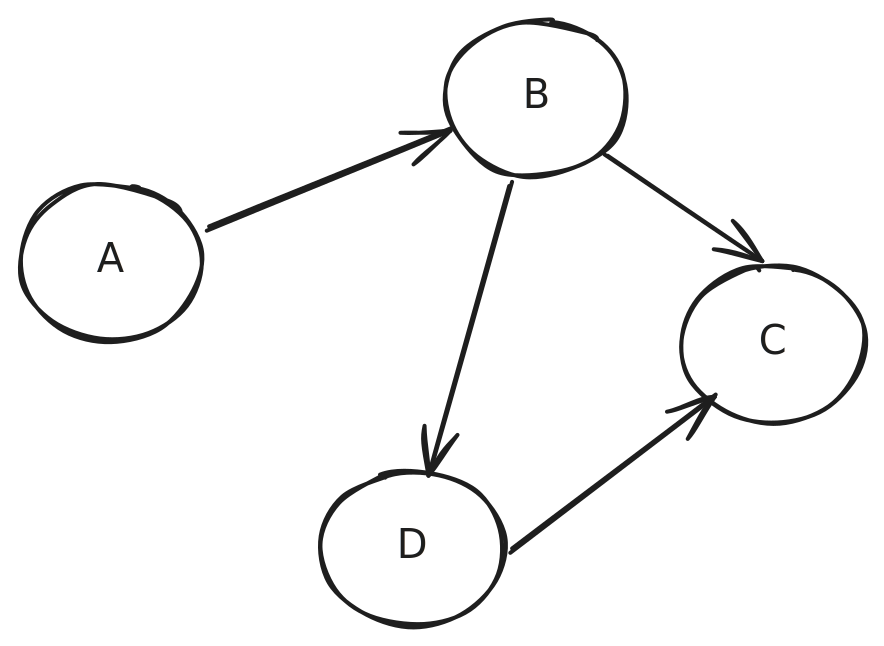

# The Class P

- Extended Church-Turing thesis

  > All physically realizable computational models are **polynomially equivalent** i.e. any one of them can simulate another with at worst a polynomial increase in running time

  - Examples:
    - A k-tapes TM that runs in $T(n)$ time can be simulated by a single-tape TM that runs in $T^2(n)$ time
    - But a nondeterministic TM, which is not physically realizable, is not polynomially equivalent
      - A nondeterministic single-tape TM that runs in $T(n)$ time can be simulated by a single-tape deterministic TM that runs in $2^{O(T(n))}$ time

- So, if a problem has a polynomial running time solution on one physical computer, it has a polynomial running time solution on all physical computers

  >  The class P is the class of languages that are decidable in polynomial time on a deterministic single-tape Turing machine (and equivalently on any physical realizable machine)

  - Remember that a formal language being decidable is equivalent to a specific problem being solvable
  - Practically speaking, we care about differences within polynomial time (e.g. $n^3$ vs $n^2$)
  - But theoretically speaking, we don't care because polynomial time algorithms are tractable
    - tractable in the sense that they can be solved in a reasonable amount of time
    - no new breakthrough in computational model is needed

- Most algorithms you've encountered are in the class P
  - Sorting, searching, etc.
- Here we'll illustrate a graph algorithm as an example of a class P problem
  - Why a graph? Because it also has problems that seem to be exponential and so provides a good base to study complexity

## Graph Background

- A graph denotes relationships between pairs of entities e.g. friendship between two people

  

- Anatomy

  - **Vertex** or **node**
  - **Edge**
    - **directed** (as above) or **undirected** (implicitly bidirectional)

- Vast range of systems where graphs help understand structure

  - Web, internet, social, epidemiological, transportation, circulatory, etc.

- We even used graphs to represent the states and transitions of DFAs, NFAs, and TMs

- A common way to represent a graph in code is the adjacency set representation

  - e.g. $A \rightarrow \{B\}, B \rightarrow \{C, D\}, C \rightarrow \{ \}, D \rightarrow \{ C \}$

    ```java
    // V is the type parameter for a vertex (e.g. String or Integer)
    Map<V, Set<V>> vertexToNeigbors = new HashMap<>();
    ```

- A minimal API to construct a graph is the following:

  ```java
  public interface Graph<V> {
      /** Adds a vertex to the graph. */
      void addVertex(V v);
  
      /** Adds an edge, creating vertices if needed. */
      void addEdge(V v, V w);
  
      /** Returns the vertices. */
      Iterable<V> getVertices();
  
      /** Returns the neighbors of v. */
      Iterable<V> getNeighbors(V v);
  
      /** Returns whether v is in the graph. */
      boolean hasVertex(V v);
  
      /** Returns whether v-w edge is in the graph. */
      boolean hasEdge(V v, V w);
  }
  ```

  

## The Path Problem

> Given a directed graph G and two nodes s and t, determine if there's a path from s to t

Restated in terms of a formal language:

> PATH = {\<G, s, t\> | G is a directed graph that has a path from s to t}

- In the example graph above:
  - If s=A and t=C, then there are multiple paths
    - A->B->C and A->B->D->C
  - If s=C and t=A, then there is no path
- Is there a polynomial time algorithm to solve the path problem?
- Attempt 1: *brute-force search*
  - Examine all potential paths in G and determine whether any of them is a directed path from s to t
  - How many potential paths are there if there are $m$ Vertices in G?
    - Length 1 : 1 (an edge from s to t)
    - Length 2: $m-2$ (s -> u -> t where u is any node other than s and t)
    - Length 3: $(m-2)(m-3)$
    - ...
    - Length $m-1$: $(m-2)(m-3)...1$ 
    - So $O(m^{m-2})$ by keeping the leading term in m in the length m paths => exponential!
  - Intractable!
- Attempt 2: **breadth-first search (BFS)**
  - Maintain a set of nodes that are reachable from s, initialized to R = {s}
  - Maintain a queue of nodes to process, initialized to Q = [s]
  - While Q is not empty:
    - Dequeue node u
    - For each neighbor n of u:
      - If n == t
        - return true
      - If n is not in R:
        - Add n to R
        - Enqueue n to Q
  - return false
- BFS is polynomial 
  - Each node is processed at most once => O(m)

## Deciding Regular Languages

> Every regular language is a member of P

Restated less formally:

> Given a string, a DFA can decide whether the string matches the associated regular expression in polynomial time

Proof:

1. Every regular language can be decided by a DFA
2. On an input string $w$, the DFA scans the string from left to right, visiting each symbol once
3. So the runtime is linear in the length of $w$ => polynomial

## Relatively Prime Problem

> Given two natural numbers, determine whether they are relatively prime i.e. 1 is the largest integer that evenly divides both of them

Restated in terms of a formal language:

> RELPRIME = { \<x, y\> x and y are relatively prime}

- Brute-force search
  - For each divisor (> 1) of one of the numbers
    - Check if it's also a divisor of the other number
    - If so, return true
  - Return false
- A k-digit number can have a magnitude as large as $10^k$, which admits divisors as large as $10^{k/2}$
- So brute-force search is exponential in the number of digits
- Is there a polynomial time algorithm?
- **Reduce** to the problem of finding the **greatest-common-divisor (gcd)** and solve gcd using Euclid's algorithm
  - Euclid's algorithm:
    - The gcd does not change if the smaller number is subtracted from the bigger number
    - Gcd(x, y) = gcd(y, x % y) = .... until one of the numbers is 0 and the other number is the gcd
  - Details left as an exercise

​	---