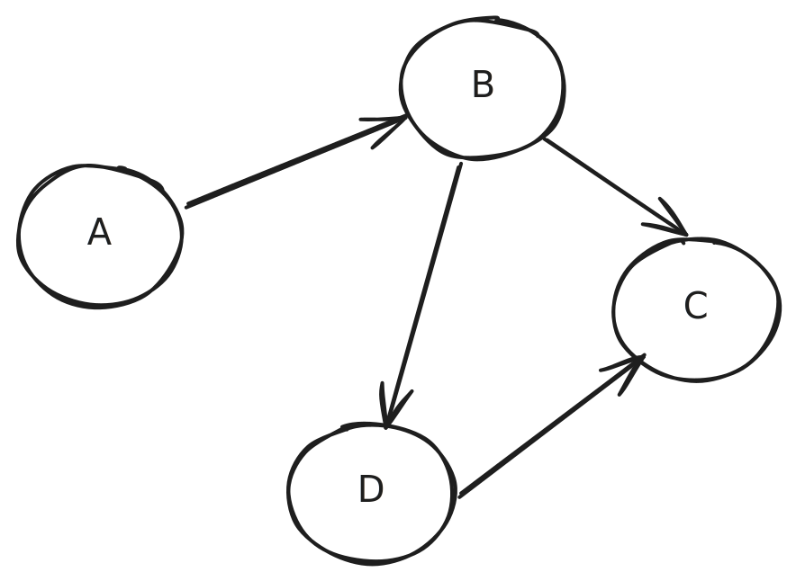

# Complexity 
### Which Solvable Problems Are Tractable?

---

# Course Journey So Far

**Universality** - Turing machines can compute anything computable

**Computability** - Some problems can't be solved by any computer

**Today: Complexity** - Among solvable problems, which are practical?

---

# The Big Question

We know some problems are **solvable**...

But can they be solved **efficiently**?

**Key insight:** Solvable ≠ Practical

---

# Extended Church-Turing Thesis

**Universality plus efficiency:**

A Turing machine can **efficiently** perform any computation that can be efficiently computed by any physically realizable computer

**What this means:**
- Any algorithm running in time T(n) on a physical computer
- Can be simulated by a TM in time (T(n))^k for some constant k
- TM may be slower, but not **exponentially** slower

---

# Tractable vs Intractable

**Tractable problems:** Solvable in **polynomial time**
- Time proportional to n^k (for some constant k)
- Examples: n, n², n³, n¹⁰

**Intractable problems:** Require **exponential time**
- Time proportional to 2^(n^k)
- Examples: 2^n, 2^(n²), 2^(√n)

**The divide:** Polynomial vs Exponential determines practicality

---

# Polynomial vs Exponential: The Reality

A supercomputer can execute ~$10^{18}$ instructions per second (exaflop)

| Algorithm                | O(n)                                                             | n      | Supercomputer Run Time                                           |
| ------------------------ | ---------------------------------------------------------------- | ------ | ---------------------------------------------------------------- |
| Insertion sort           | $n^2$ (polynomial)                                               | $10^9$ | ~1 second                                                        |
| Subsets of n things      | $2^n$ (exponential)                                              | 100    | > 10,000 years                                                   |
| Permutations of n things | $n! \sim \sqrt{2\pi n} \left(\frac{n}{e}\right)^n$ (exponential) | 52     | > $10^{42}$ years > age of the universe ($14 \times 10^9$ years) |

**Bottom line:** Exponential = effectively impossible for modest inputs

---

# Section 2: Measuring Complexity

## What is Complexity?

---

# Understanding Complexity

**Complexity ≠ Difficulty of Solution**
- Remove human ability from equation
- Assume optimal solver who can solve any solvable problem

**Complexity = Tractability of Finding Solution**
- **Time:** How long does it take?
- **Memory:** How much space is needed?

**Practical reality:** A program that's too slow or uses too much memory is useless

---

# Two Analysis Strategies

**A posteriori (after the fact):**
- Run the program and measure time/memory
- Real-world performance data

**A priori (before the fact):**
- Analyze the program without running it
- Predict performance characteristics

**Best practice:** Use **both** approaches!
- Before coding: analyze algorithms for feasibility
- After coding: measure to verify requirements

---

# Runtime Analysis Framework

**Donald Knuth:** Turing Award winner, father of algorithm analysis

**Total run time = Σ(cᵢ × fᵢ)**
- cᵢ = cost of executing statement i (system-dependent)
- fᵢ = frequency of executing statement i (algorithm-dependent)

**Problem:** This calculation is tedious!

**Solution:** Use **order of growth** model

---

# Order of Growth

**Key concepts:**
- Most programs have a **problem size** (n) that characterizes difficulty
- As problem size increases, runtime increases
- Order of growth expresses **how runtime scales** with problem size

**Expressed using Big O notation:** O(f(n))
- n is the problem size
- f(n) is a function describing growth rate

---

# Big O Simplification Rules

**Rule 1: Keep only the leading term**
- n² + 2n + 3 → **n²**
- Highest power dominates for large n

**Rule 2: Set coefficient to 1**
- 5n² → **n²**
- 100n → **n**

**Why these rules?**
- Focus on growth rate, not constants
- Constants matter less as n grows large
- Simplifies comparison between algorithms

---

# 📊 Quick Poll

**Which has the fastest growth rate?**

A) O(n log n)
B) O(n²)
C) O(2^n)
D) O(n!)

---

# Common Growth Rates

| Big O      | Name         | Example                          |
| ---------- | ------------ | -------------------------------- |
| O(1)       | Constant     | Array access                     |
| O(log n)   | Logarithmic  | Binary search                    |
| O(n)       | Linear       | Linear search                    |
| O(n log n) | Linearithmic | Merge sort                       |
| O(n²)      | Quadratic    | Bubble sort                      |
| O(n³)      | Cubic        | Matrix multiplication            |
| O(2^n)     | Exponential  | Power set generation             |
| O(n!)      | Factorial    | Traveling salesman (brute force) |

---

# Analysis Focus: Worst Case

**Three cases for any algorithm:**

**Best case:** Fastest possible runtime
- Example: Linear search finds element first → O(1)

**Average case:** Expected runtime on random inputs
- Example: Linear search on average → O(n/2) = O(n)

**Worst case:** Slowest possible runtime
- Example: Linear search finds element last → O(n)

**For complexity theory:** Focus on **worst case**
- Provides guarantees and simplifies analysis

---

# Section 3: The Class P

## Polynomial Time Algorithms

---

# Extended Church-Turing Thesis Revisited

**All physically realizable models are polynomially equivalent**

**What this means:**
- k-tape TM running in T(n) time
- Can be simulated by single-tape TM in T²(n) time
- Polynomial slowdown, not exponential!

**Important exception:**
- Nondeterministic TMs are NOT physically realizable
- Single-tape nondeterministic TM in T(n) time
- Requires 2^O(T(n)) time on deterministic TM

---

# Defining Class P

**The class P consists of languages decidable in polynomial time on a deterministic single-tape Turing machine**

**Equivalently:** P = problems solvable in polynomial time on any physically realizable computer

**Key insight:**
- Polynomial time = tractable
- No computational breakthrough needed
- Differences within polynomial (n² vs n³) matter practically
- But theoretically, all polynomial time is "efficient"

---

# Regular Languages in P

**Theorem:** Every regular language is a member of P

**Proof:**
1. Every regular language can be decided by a DFA
2. DFA scans input string w left to right once
3. Runtime is linear in length of w
4. Linear is polynomial → Regular languages ∈ P

**Takeaway:** Pattern matching with regular expressions is efficient!

---

# Graph Background

**Graph:** Represents relationships between pairs of entities

<div class='cols'><div>

**Components:**
- **Vertices** (nodes): Entities
- **Edges**: Connections between vertices
- **Directed** vs **Undirected** edges

**Applications:** Web, social networks, transportation, circuits, state machines

</div><div>



</div></div>

---

# Graph Representation in Code

**Adjacency set representation:**

```java
// A → {B}, B → {C, D}, C → {}, D → {C}
Map<V, Set<V>> vertexToNeighbors = new HashMap<>();
```

**Minimal Graph API:**

```java
public interface Graph<V> {
    void addVertex(V v);
    void addEdge(V v, V w);
    Iterable<V> getVertices();
    Iterable<V> getNeighbors(V v);
    boolean hasVertex(V v);
    boolean hasEdge(V v, V w);
}
```

---

# The PATH Problem

**Intuitive:** Given a directed graph G and two nodes s and t, determine if there's a path from s to t

**Formal language:**
PATH = {⟨G, s, t⟩ | G is a directed graph with a path from s to t}

**Question:** Is PATH in P?

---

# PATH: Failed Approach

**Attempt 1: Brute-force search**

Examine all potential paths in G:
- Length 1: 1 path (direct edge s → t)
- Length 2: (m-2) paths
- Length 3: (m-2)(m-3) paths
- Length m-1: (m-2)(m-3)...1 paths

**Total:** O(m^(m-2)) paths → **Exponential!**

**Result:** Intractable approach

---

<!-- _class: compact -->

# PATH: Successful Approach

**Attempt 2: Breadth-First Search (BFS)**

**Algorithm:**
- Maintain set R of reachable nodes from s, initially R = {s}
- Maintain queue Q of nodes to process, initially Q = [s]
- While Q is not empty:
  - Dequeue node u
  - For each neighbor n of u:
    - If n == t, return true
    - If n not in R: add n to R, enqueue n to Q
- Return false

**Complexity:** Each node processed at most once → O(m) → **Polynomial!**

---

# Relatively Prime Problem

**Problem:** Given two natural numbers x and y, determine if they are relatively prime (share no common factors except 1)

**Naive approach:** Find all factors of both numbers
- For k-digit numbers, factors can be as large as 10^(k/2)
- Exponential in input size!

**Efficient approach:** Euclidean algorithm
- Repeatedly apply: gcd(x,y) = gcd(y, x mod y)
- Runs in O(k²) time
- Polynomial! → Relatively Prime ∈ P

---

# Section 4: The Class NP

## Verification vs Solution

---

# Beyond P: Harder Problems

**We've seen:** Some problems have polynomial time solutions (Class P)

**Reality:** Many useful problems have no known polynomial solution

**Open question:** 
- Have we just not discovered the right mathematical principles?
- Or are these problems intrinsically intractable?

---

# The Hamiltonian Path Problem

<div class='cols'><div>

**Definition:** A Hamiltonian path in directed graph G goes through each node exactly once

**Problem:** Given graph G and vertices s, t, does G have a Hamiltonian path from s to t?

**Formal language:**
HAMPATH = {⟨G, s, t⟩ | G has a Hamiltonian path from s to t}

**Also known as:** The Traveling Salesman Problem

</div><div>


</div></div>

---

# HAMPATH: Exponential Solution

**Brute-force approach:**
- Consider all potential paths from s to t
- Check if any visit every node exactly once
- **Complexity:** O(m^(m-2)) paths to check

**Why exponential?**
- Must consider all permutations of nodes
- No known way to prune search space efficiently

**Result:** Appears intractable for large graphs

---

# HAMPATH: Polynomial Verification

**Key insight:** Can't efficiently **find** a Hamiltonian path, but can efficiently **verify** one!

**Verification algorithm:**
- Given a proposed path p from s to t
- Check that each edge in p exists in G
- Check that p visits every node exactly once
- **Complexity:** O(m) → Polynomial!

**This asymmetry is fundamental to NP**

---

# Verifier Definition

**A verifier for language L is algorithm V where:**

L = {w | V accepts ⟨w, c⟩ for some certificate c}

**For HAMPATH:**
- w = ⟨G, s, t⟩ (the problem instance)
- c = p (the Hamiltonian path, if it exists)
- V verifies in polynomial time whether p is valid

**Certificate (or proof):** The "hint" that makes verification easy

---

# Defining NP (Version 1)

**Definition 1:** NP is the class of languages that have polynomial time verifiers

**In other words:**
- Problems where you can verify a solution in polynomial time
- Even if you can't find the solution efficiently

---

# 🤔 Think-Pair-Share

**Question:** Can you think of everyday problems that are hard to solve but easy to verify once you have the answer?

**Hint:** Think about puzzles, games, or other challenges

---

# Nondeterministic Solution to HAMPATH

**Nondeterministic TM approach:**
- For each permutation of nodes (starting with s, ending with t)
- Use polynomial time verifier to check if it's Hamiltonian
- Since permutations checked in parallel (nondeterministically)
- Total time is polynomial!

**The catch:** Nondeterministic TMs aren't physically realizable
- Simulating on deterministic TM takes exponential time

---

# Defining NP (Version 2)

**Definition 2:** NP is the class of languages decided by some nondeterministic polynomial time Turing machine

**Two equivalent definitions:**
1. Has polynomial time verifier (deterministic, with certificate)
2. Decidable in polynomial time nondeterministically

**NP stands for:** Nondeterministic Polynomial
- **NOT** "Non-Polynomial" (common misconception!)

---

# Examples of NP Problems

<div class='cols'><div>

**1. Puzzles**
- Sudoku, KenKen, Crossword, Jigsaw
- Hard to solve, easy to check solution

**2. Prime Factorization**
- Given 100-digit number, find prime factors
- Would take > 10²⁴ years on supercomputer!
- But verifying factors is easy: just multiply

</div><div>

**3. CLIQUE**
- Find k nodes in graph where all are connected to each other
- Verification: check k(k-1)/2 edges exist

**4. SUBSET-SUM**
- Given set of numbers and target t, find subset summing to t
- Verification: check if provided subset sums to t

</div></div>

---

# 💡 Application Exercise

**Problem:** Prove that CLIQUE is in NP

CLIQUE = {⟨G, k⟩ | G is undirected graph with k-clique}

**Your task:**
1. Method 1: Describe polynomial time verifier given a k-clique certificate
2. Method 2: Describe nondeterministic TM deciding CLIQUE
3. What is the certificate?

---

# Complement Class: coNP

**Definition:** coNP contains complements of NP languages

**Examples:**
- NOT-CLIQUE = {⟨G, k⟩ | G has NO k-clique}
- NOT-SUBSET-SUM = {⟨S, t⟩ | No subset of S sums to t}

**Challenge:** Hard to verify something doesn't exist!
- No certificate proves absence
- Would need to check all possibilities

**Open question:** Is coNP = NP?

---

# Section 5: P vs NP

## The Million Dollar Question

---

# The Relationship Question

**What we know:**
- **P:** Problems solvable in polynomial time
- **NP:** Problems verifiable in polynomial time

**Key observation:**
Every problem in P is also in NP
- Why? If you can solve it in polynomial time, you can verify in polynomial time (just solve it!)

**This means:** P ⊆ NP

**The question:** Is P = NP, or is P ⊂ NP?

---

# Two Possible Universes


<div class='cols'><div>

**Universe 1:** P ⊂ NP (P is strictly smaller)
- Verifying is easier than solving
- Some problems are intractable

</div><div>

**Universe 2:** P = NP (P equals NP)
- Every verifiable problem is efficiently solvable
- Finding = Checking

</div></div>

---

# Why This Matters

**If P = NP:**
- Many "hard" problems become tractable
- Cryptography would collapse
- Optimization problems easily solved
- Fundamental shift in computer science

**If P ≠ NP:**
- Confirms our intuition about hard problems
- Cryptography remains secure
- Some problems inherently intractable
- Limits of efficient computation established

---

# The Million Dollar Question

**Current status:**
- Millennium Prize Problem (one of seven)
- $1,000,000 prize from Clay Mathematics Institute
- Announced in 2000, still unsolved
- Most computer scientists believe P ≠ NP

---

# 📊 Quick Poll

**Which do you think is more likely?**

A) P = NP (verification and solution are equally hard)
B) P ≠ NP (verification is easier than solution)
C) We'll never know
D) The question is somehow ill-posed

---

# Section 6: NP-Completeness

## The Hardest Problems in NP

---

# 1970s Breakthrough

**Key discovery:** Not all NP problems are equally hard

**Central insight:**
- ALL NP problems can reduce to a **subset** of NP problems
- These hardest problems are called **NP-complete**

**Why this matters:**
- Focus effort on NP-complete problems
- If ANY NP-complete problem has polynomial solution → P = NP
- If ANY NP-complete problem proven intractable → P ≠ NP

---

# Polynomial Time Reducibility

**Reduction concept (recall):**
Convert problem A to problem B such that B's solution solves A

**Polynomial time reduction:**
The conversion itself must run in polynomial time

**Implication:**
If A reduces to B in polynomial time, and B ∈ P, then A ∈ P

**Key idea:** Reductions transfer tractability

---

# The Cook-Levin Theorem (1971)

**Theorem:** Every nondeterministic Turing Machine (every problem in NP) can be reduced to Boolean Satisfiability (SAT) in polynomial time

**What this means:**
- SAT is in NP
- Every NP problem reduces to SAT
- Therefore, SAT is **NP-complete**

**First NP-complete problem discovered!**

---

# Boolean Satisfiability (SAT)

**Problem:** Given boolean expression, does a satisfying assignment exist?

**Example expression:**
(x₁ ∨ ¬x₂) ∧ (x₂ ∨ x₃) ∧ (¬x₁ ∨ ¬x₃)

**Satisfying assignment:**
x₁ = true, x₂ = true, x₃ = false makes expression true

**Why NP-complete:**
- Can verify assignment in polynomial time
- Can encode any NP problem as SAT instance

---

# Cook-Levin Proof Sketch (1/3)

**Step 1:** Represent TM computation as table

**Example:** TM deciding if binary string ends in 1, on input "101"

| Time | State    | Tape Head | cell 0 | cell 1 | cell 2 | cell 3 |
| ---- | -------- | --------- | ------ | ------ | ------ | ------ |
| 0    | pending1 | cell 0    | **1**  | 0      | 1      | ⊔      |
| 1    | last1    | cell 1    | 1      | **0**  | 1      | ⊔      |
| 2    | pending1 | cell 2    | 1      | 0      | **1**  | ⊔      |
| 3    | last1    | cell 3    | 1      | 0      | 1      | **⊔**  |
| 4    | accept   | cell 2    | 1      | 0      | **1**  | ⊔      |

---

# Cook-Levin Proof Sketch (2/3)

**Step 2:** Encode table as boolean variables

**Variable types:**
- Q_{t,q} = 1 iff at time t, TM in state q
- H_{t,c} = 1 iff at time t, tape head at cell c
- S_{t,c,s} = 1 iff at time t, symbol at cell c is s

**Example:**
- Q_{0,pending1} = 1, Q_{0,last1} = 0, Q_{0,accept} = 0
- H_{0,0} = 1, H_{0,1} = 0, H_{0,2} = 0, H_{0,3} = 0
- S_{0,0,1} = 1, S_{0,0,0} = 0, S_{0,0,⊔} = 0

---

# Cook-Levin Proof Sketch (3/3)

**Step 3:** Write boolean expressions for constraints

**Constraint types:**
1. Initial configuration: Q_{0,start} ∧ H_{0,0} ∧ S_{0,0,input[0]} ∧ ...
2. Accepting configuration: Q_{T,accept}
3. Valid transitions: If configuration C₁ then configuration C₂
4. Uniqueness: One state, one head position, one symbol per cell

**Final expression:** e = e_start ∧ e_move ∧ e_accept ∧ e_cell

**Key insight:** e is satisfiable ⟺ TM accepts input!

---

# Karp's 21 NP-Complete Problems (1972)

**Extended the list through polynomial time reductions**

**Selection of famous NP-complete problems:**
1. SAT (Boolean Satisfiability) - Starting point
2. 3-SAT (Satisfiability with 3 literals per clause)
3. CLIQUE (Finding densely connected subgraphs)
4. Vertex Cover (Selecting nodes to cover edges)
5. Hamiltonian Path (Visiting all nodes once)
6. Traveling Salesman (Shortest Hamiltonian cycle)
7. Graph Coloring (Coloring with k colors)
8. Knapsack (Selecting items for maximum value)

---

# More NP-Complete Problems

9. Partition (Splitting set into equal sums)
10. Subset Sum
11. Integer Programming
12. Set Packing
13. Set Cover
14. Feedback Arc Set
15. Exact Cover
16. Hitting Set
17. Steiner Tree
18. 3-Dimensional Matching

**Common thread:** All practical, important problems!

---

# Reduction Chains

**How new NP-complete problems are found:**

SAT → 3-SAT → CLIQUE → Vertex Cover → Hamiltonian Path → TSP

**Process:**
1. Start with known NP-complete problem
2. Show polynomial reduction to new problem
3. Show new problem is in NP
4. Conclude new problem is NP-complete

**Result:** Thousands of NP-complete problems identified

---

# Beyond NP-Complete: NP-Hard

<div class='cols'><div>

**NP-hard:** At least as hard as NP-complete

**Key difference:** NP-hard problems not necessarily in NP!

**Examples:**
- Halting Problem (undecidable!)
- Optimization versions of NP problems
  - Not "does solution exist?" but "what's the best solution?"

</div><div>


</div></div>

---

# Practical Implications

**If you encounter NP-complete problem:**

**Don't expect exact polynomial algorithm**
- No one has found one yet
- If you do, you've solved P vs NP!

**Instead, use practical approaches:**
1. Approximation algorithms (near-optimal solutions)
2. Heuristics (work well in practice)
3. Restrict to special cases (polynomial subcases)
4. Accept exponential time for small inputs
5. Use probabilistic/randomized algorithms

---

<!-- _class: compact -->

# Summary: The Complexity Hierarchy

<div class='cols'><div>

**P:** Problems solvable in polynomial time
- Tractable, practical
- Examples: sorting, shortest path, pattern matching

**NP:** Problems verifiable in polynomial time
- Contains P
- Examples: Hamiltonian path, SAT, knapsack

**NP-Complete:** Hardest problems in NP
- All NP problems reduce to these
- Examples: SAT, 3-SAT, TSP, graph coloring

**NP-Hard:** At least as hard as NP-complete
- May not be in NP (may be undecidable)

</div><div>


</div></div>

---

# The Big Picture

**Hierarchy of problem difficulty:**

1. **Regular** (DFA) - Always tractable, always polynomial
2. **Context-Free** (PDA) - Often tractable
3. **P** (Deterministic TM, polynomial) - Tractable by definition
4. **NP** (Nondeterministic TM, polynomial) - Verifiable, possibly tractable
5. **NP-Complete** - Hardest NP problems
6. **Decidable** - May require exponential time
7. **Recognizable** - May not halt on rejection
8. **Unrecognizable** - Impossible to compute

---

# ✍️ Reflection

1. **Most important thing** you learned about complexity theory today

2. **One question** you still have about P, NP, or NP-completeness

---
