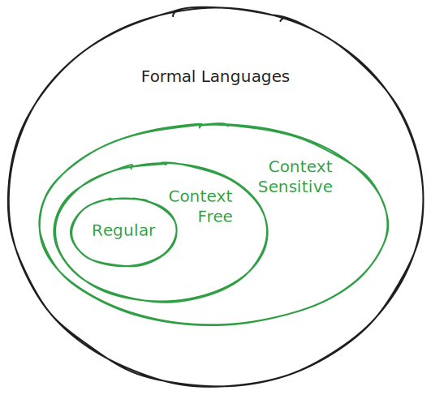

# Context Sensitive Languages (CSLs)

- Are there languages beyond CFLs?
- In other words, languages that can't be recognized by PDAs?

## Example

- Consider the language of **all strings over {a, b, c} with an equal number of as followed by bs followed by cs**
- Remember that the 2-symbol version of this language was a CFL
- However the 3-symbol version here is not a CFL (just accept this as a fact)
  - No CFG exists for it
  - No PDA can recognize it

- It is a **context sensitive language (CSL)**

## Context Sensitive Grammar (CFG)

- A CFL is specified by a context free grammar

  - Form: $A \rightarrow \alpha$ where $A$ is a variable and $\alpha$ is a string of variables and terminals
- How is a CSL specified?
- By a **context sensitive grammar (CSG)**
- What's a CSG?
  - Similar to a CFG except that the production rules are based on context i.e. LHS can be a string of variables and terminals
  - Form: $\alpha \rightarrow \beta$ where $\alpha, \beta$ are strings of variables and terminals
- Example CSG over the alphabet {a, b, c}:

  - Production rules (using AI Gemini 2.0 flash thinking)
    - $S \rightarrow a S B C$
    - $S \rightarrow a B C$
    - $C B \rightarrow B C$
    - $a B \rightarrow ab$
    - $b B \rightarrow bb$
    - $b C \rightarrow bc$
    - $c C \rightarrow cc$
  - Derive aabbcc
    - S -> aSBC -> aaBCBC -> aabCBC -> aabBCC -> aabbCC -> aabbcC -> aabbcc
- Note that the PQ system we saw earlier is a CSL (with the theorem production rule) and a set of strings specified as given (axioms)

## Linear Bounded Automata (LBA)

- A context free language is recognized by a PDA

- How is a CSL recognized?

- By a **Linear Bounded Automaton (LBA)**

- What's that?

  - Essentially a Turing Machine with a finite tape

  - What's a Turing Machine? We'll get to it soon
  

## Language Hierarchy

| Language Type     | Specification             | Recognition                     |
| ----------------- | ------------------------- | ------------------------------- |
| Regular           | Regular Expression        | NFA                             |
| Context Free      | Context Free Grammar      | PDA (NFA with stack)            |
| Context Sensitive | Context Sensitive Grammar | LBA (Restricted Turing Machine) |

