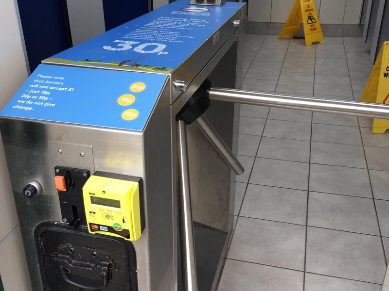
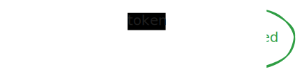
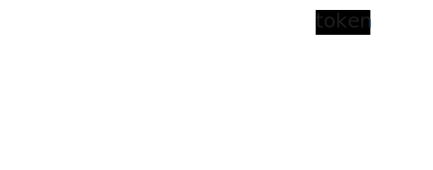
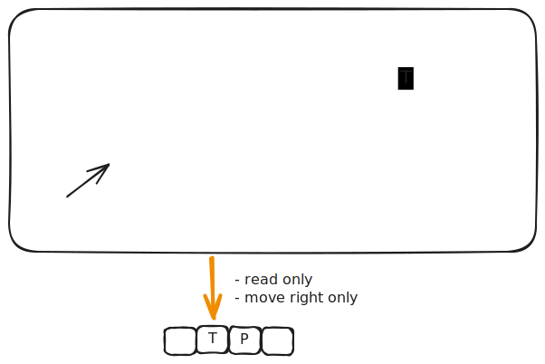
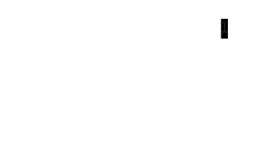
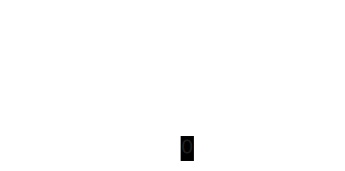
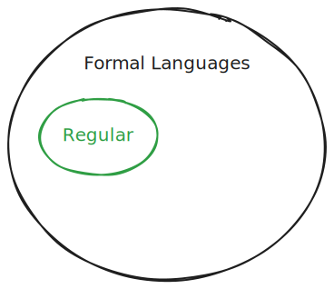

<!-- _class: lead -->

# Deterministic Finite Automata (DFA)

## An abstract computer with extremely limited memory

---

# Learning Objectives

By the end of this lecture, you will be able to:

- **Identify** real-world systems that can be modeled as DFAs
- **Construct** state transition diagrams for simple DFAs
- **Analyze** DFAs to determine their language
- **Design** DFAs to recognize specific languages
- **Implement** DFAs in code

---

# Let's Start with Something Familiar

## The Turnstile



**Question:** How many different states can a turnstile be in?

---

# Turnstile States

The turnstile can be in one of two **states**:

1. **Locked** - won't let you through
2. **Unlocked** - ready to let one person through

We can represent states as vertices in a graph:


---

# State Transitions

## What happens when you insert a token?

If the turnstile is **locked** and you insert a token, it **unlocks**



The **state-transition** is a directed edge labeled with the input/event

---

# State Transitions (cont.)

## What happens when you push?

If the turnstile is **unlocked** and you push it, it lets you pass and **locks** again


---

# Complete the Model

## What about the other cases?

<div class="columns">
<div>

**Token while unlocked:**
- Stays unlocked



</div>
<div>

**Push while locked:**
- Stays locked


</div>
</div>

---

# State Transition Table

Another way to represent the same information:

|              | Token    | Push   |
| ------------ | -------- | ------ |
| **Locked**   | Unlocked | Locked |
| **Unlocked** | Unlocked | Locked |

**Key Insight:** The state-transition graph/table specifies a DFA that controls the turnstile
- Think of it as a single-bit computer storing the current state
- Contains circuitry to transition based on inputs

---

<!-- _class: lead -->

# 🤔 Active Learning

## Think-Pair-Share (2 minutes)

Think of another real-world system that has:
- A finite number of states
- Transitions based on inputs

Share with your neighbor, then we'll discuss!

---

# DFAs Are Everywhere!

## Physical Systems
- **Elevators** - floors and button presses
- **Vending machines** - money inserted and product selection
- **Traffic lights** - timing and sensor inputs

## Non-Physical Systems
- **Network protocols** - TCP three-way handshake
- **Text parsing** - finding patterns in strings
- **User input validation** - checking format correctness
- **Workflow management** - approval processes

---

# Abstract DFA Definition

A DFA consists of:

1. **States** (finite set)
   - One **start state** (initial state)
   - One or more **accept states** (final states)

2. **Alphabet** - finite set of input symbols

3. **Transitions** - rules for changing states based on input
   - Process input left to right
   - If in accept state after all input → string is **accepted**
   - Set of all accepted strings = **language** of the DFA

---

# Turnstile DFA

<div class='columns'><div>

Let's formalize our turnstile:

1. **States:** {locked, unlocked}
   - Start state: locked
   - Accept states: {locked}

2. **Alphabet:** {T, P} 
   - T = token insertion
   - P = push

3. **Transitions:** As shown in our diagram

</div><div>



</div></div>

---

# Turnstile Language

<div class='columns'><div>

The Turnstyle DFA **decides** the language of strings over {T, P} that take the turnstile from the locked state back to the locked state

Examples:
1. ε
2. TP
3. P...P
4. P...PTP
5. P...PTT...TP
6. P...PTT...TPP...P

</div><div>


</div></div>

---

<!-- _class: lead -->

# 🎯 Practice Problem 1

<div class='columns'><div>



</div><div>

**Questions:**
1. What is the alphabet?
2. What is the language that it accepts/recognizes/decides?

</div></div>

---

# Solution to Practice 1

<div class='columns'><div>


</div><div>

1. **Alphabet:** {0, 1}

2. **Language:** Binary strings that are either the empty string or end in 0 (even integers)

</div></div>

---

<!-- _class: lead -->

# 🎯 Design Challenge 1

## Your Turn!

Design a DFA that recognizes binary strings that **end in 1** (i.e. odd integers)

---

# Solution: Strings Ending in 1



**Key insight:** 
- q1: Haven't seen a 1 yet OR just saw a 0
- q2: Just saw a 1 (accept state)

---

<!-- _class: lead -->

# 🎯 Design Challenge 2

Design a DFA for binary strings with an **even number of 0s**
(including no 0s and the empty string)

---

# Solution: Even Number of 0s


**Key insight:**
- even: Even number of 0s seen or no symbols seen (accept)
- odd: Odd number of 0s seen
- 1s don't affect the count!

---

# Implementing DFAs in Code

## Java API Design

```java
public class DFA {
  public static class State {
    void addTransition(Character symbol, State to) {...}
    State getTransition(Character symbol) {...}
  }
  
  public void setStartState(State state) {...}
  public State getStartState() {...}
  public void addAcceptState(State state) {...}
  public Set<State> getAcceptStates() {...}
  
  public boolean accepts(String input) {...}
}
```

---

# Turnstile Implementation

```java
// Construct the DFA
DFA dfa = new DFA();
State locked = new State();
State unlocked = new State();

dfa.setStartState(locked);
dfa.addAcceptState(locked);

locked.addTransition('T', unlocked);
locked.addTransition('P', locked);
unlocked.addTransition('T', unlocked);
unlocked.addTransition('P', locked);

// Evaluate inputs
boolean result1 = dfa.accepts("TP");      // true
boolean result2 = dfa.accepts("PPTPTPPP"); // true
```

---

# Regular Languages

> A formal language is called a **regular language** if some DFA recognizes it.



All languages we've seen today are regular languages!

---

# Summary

## Key Takeaways

✅ DFAs are simple computational models with finite memory
✅ They consist of states, transitions, and an alphabet
✅ Real-world controllers often implement DFAs
✅ DFAs recognize regular languages
✅ We can implement and simulate DFAs in code

---

