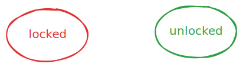
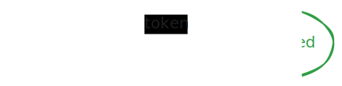
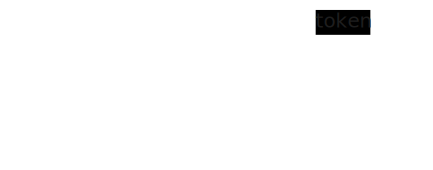
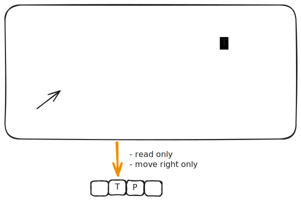
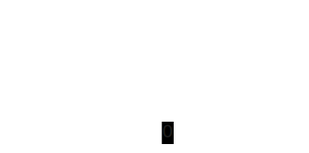

# Deterministic Finite Automata (DFA)

> An abstract computer with extremely limited memory

## Turnstile

Let's start with a practical example of a DFA in the real-world.


- The turnstile can be in one of two **states**
  1. *locked*
  2. *unlocked*

  The states can be represented as vertices in a graph.

  
  
- If the turnstyle is locked and you insert a token, it unlocks

  The **state-transition** can be represented as a directed edge between the states, labeled with the input/event that triggers the transition.

  

- If the turnstyle is unlocked and you push it, it let's you pass and locks again

  

- If you insert a token while the turnstyle is unlocked, it stays unlocked

  

- If you push while the turnstyle is locked, it stays locked
  
  

State transition table:

|              | Token    | Push   |
| ------------ | -------- | ------ |
| **Locked**   | Unlocked | Locked |
| **Unlocked** | Unlocked | Locked |

- **The state-transition graph/table specifies a DFA that controls the turnstyle**
  - Think of it as a single-bit special-purpose computer that stores which of the two states the turnstyle is in at any given time and contains electronic circuitry to transition between the states based on token-insertion or push

## More Examples

- Other examples of finite automata as controllers of real-world physical systems:
  - Elevators
  - Vending machines
  - Traffic
  - ...
- Examples of finite automata in non-physical real-world scenarios:
  - Protocols such as TCP connection establishment (three-way handshake)
  - Text parsing
  - User input validation
  - Workflow management
  - ...

## Abstract DFA

An abstract DFA consists of:

1. A finite number of **states**
   - One state is designated the ***start* state** (the initial state of the machine)
   - One or more states are designated ***accept* states**
1. An input sequence of symbols from an **alphabet** (finite set of symbols) which the machine reads from left to right 
2. A set of **transitions** that specify how the machine changes state based on an input symbol
   - If the machine is in an accept state after processing all input symbols, then the input is **recognized** or accepted by the machine 
   - The set of all input strings recognized by the machine is the formal **language** of the machine

### Applied To Turnstyle

1. States: {locked, unlocked}
   - Start state: locked
   - Accept states: {locked}
     - Denotes that any combination of tokens/pushes that take the turnstyle from a locked state back to a locked state is the language of the turnstyle
2. Alphabet: {T, P} where T denotes token-insertion and P denotes push


Graph:



Strings in the language are made up of the following sequences:
1. 'P' 0 or more times (stays in locked)
2. The following sequence 0 or more times:
   1. 'T' (transitions to unlocked)
   2. 'T' 0 or more times (stays in unlocked)
   3. 'P' (admits and transitions to locked)
3. 'P' 0 or more times (stays in locked)


### Exercises

1. Consider the following DFA:

    

    1. What is its alphabet?
    2. What is its language?

         Binary strings with at least one 1 and an even number of 0s after the last 1.

1. Define a DFA that recognizes the language of binary strings that end in 1.

    

2. Design a DFA for the language of binary strings that contain an even number of 0s (including no 0s and the empty string).

    

## Virtual DFA

A DFA can be constructed and simulated using a Java class that has the following API:

```java
public class DFA {
  public static class State {
    void addTransition(Character symbol, State to) {...}
    State getTransition(Character symbol) {...}
  }
  
  public void setStartState(State state) {...}
  public State getStartState() {...}
  public void addAcceptState(State state) {...}
  public Set<State> getAcceptStates() {...}
  
  public boolean accepts(String input) {...}
}
```

Here's the turnstyle DFA:

```java
// Construct the DFA
DFA dfa = new DFA();
State locked = new State();
State unlocked = new State();
dfa.setStartState(locked);
dfa.addAcceptState(locked);
locked.addTransition('T', unlocked);
locked.addTransition('P', locked);
unlocked.addTransition('T', unlocked);
unlocked.addTransition('P', locked);

// Evalute inputs.
boolean result1 = dfa.accepts("TP");
boolean result2 = dfa.accepts("PPTPTPPP");
```

## Regular Languages

> A formal language is called a **regular language** if some DFA recognizes it.

So all the languages discussed above are regular languages.

