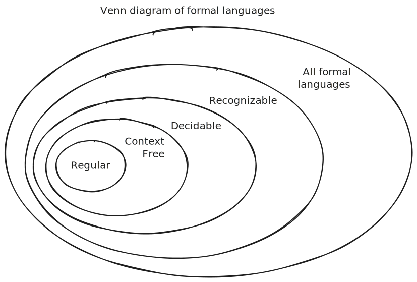

<!-- _class: lead -->

# Formal Systems & Languages
## The Mathematical Foundation of Computation

*How do we precisely define computational problems?*

---

# Learning Objectives

By the end of this session, you will be able to:

- **Define** alphabets, strings, and formal languages
- **Construct** examples of formal languages
- **Recognize** whether strings belong to specific languages
- **Explain** why formal languages are essential in computer science
- **Connect** formal languages to real-world computational problems

---

<!-- _class: lead -->

# The Big Question

## What exactly is a computational problem?

**Answer:** A **formal system** or **formal language**

*Let's build up to this answer step by step...*

---

# Building Blocks: Alphabets

## Definition
> An **alphabet** (denoted Σ) is a finite set of symbols

### Examples:

| Name | Alphabet Σ | Usage |
|:---|:---|:---|
| Binary | \{0, 1\} | Computer memory |
| Decimal | \{0, 1, 2, ..., 9\} | Human numbers |
| DNA | \{A, C, G, T\} | Genetic sequences |
| English lowercase | \{a, b, c, ..., z\} | Text processing |

---

# 🎯 Quick Check #1

## Which of these are valid alphabets?

1. \{0, 1, 2, ...\}
2. \{♠, ♣, ♥, ♦\}
3. \{$\text{red}, \text{green}, \text{blue}$\}
4. All real numbers between 0 and 1
5. \{+, -, *, /\}

**Think:** What's the key requirement for an alphabet?

---

# Quick Check #1 - Answers

## Valid Alphabets ✓

2. \{♠, ♣, ♥, ♦\} - Finite set of symbols ✓
3. \{$\text{red}, \text{green}, \text{blue}$\} - Finite set ✓
5. \{+, -, *, /\} - Finite set of operators ✓

## Invalid Alphabets ✗

1. \{0, 1, 2, ...\} - **Infinite** set ✗
4. All real numbers - **Infinite** and uncountable ✗

**Key:** Alphabets must be **finite**!

---

# Building Blocks: Strings

## Definition
> A **string** (or word) is a finite sequence of symbols from an alphabet

### Notation:
- Empty string: ε (epsilon) or λ (lambda)
- String length: |w| where w is a string
- Concatenation: xy (string x followed by string y)

---

# String Examples

## Over different alphabets:

| Alphabet | Example Strings | Notes |
|:---|:---|:---|
| \{0, 1\} | `1011`, `00`, `ε` | Binary strings |
| \{a, ..., z\} | `hello`, `xyz`, `aaa` | English-like |
| \{0, ..., 9\} | `42`, `007`, `999` | Numeric strings |

### Things to note:
- Strings are **finite** 
- Order matters: `abc` ≠ `bca`
- Repetition allowed: `aaa` is valid

---

<!-- _class: lead -->

# 📝 Active Learning: String Construction

**Your Turn:** Given alphabet Σ = \{a, b\}

1. Write all strings of length 0
2. Write all strings of length 1
3. Write all strings of length 2
4. How many strings of length n exist?

---

# String Construction - Solution

## For alphabet Σ = \(\{a, b\}\):

| Length | Strings | Count |
|:---|:---|:---|
| 0 | `ε` | 1 |
| 1 | `a`, `b` | 2 |
| 2 | `aa`, `ab`, `ba`, `bb` | 4 |
| 3 | `aaa`, `aab`, `aba`, ...| 8 |
| n | All combinations | \(2^n\) |

**Pattern:** For alphabet of size k, there are \(k^n\) strings of length n

---

# The Main Concept: Formal Languages

## Definition
> A **formal language** L is a set of strings over an alphabet

### Key Points:
- Can be finite or **infinite**
- Subset of all possible strings (L ⊆ Σ*)
- Σ* denotes all possible strings over alphabet Σ

### Examples:
- L₁ = \(\{00, 11\}\) - finite language
- L₂ = \(\{a^n b^n | n ≥ 0\}\) = \(\{ε, ab, aabb, aaabbb, ...\}\) - infinite

---

# Formal Language Examples

| Language Description | In Language ✓ | Not in Language ✗ |
|:---|:---|:---|
| **English** | `apple`, `racecar`, `computer` | `qptey`, `znwy` |
| **Palindromes** | `bob`, `racecar`, `noon` | `apple`, `banana` |
| **Prime numbers** | `2`, `3`, `5`, `7`, `11` | `1`, `4`, `6`, `8` |
| **Valid emails** | `user@domain.com` | `user@`, `@domain` |
| **Balanced parentheses** | `()`, `(())`, `(()())` | `(`, `())`, `(()` |

---

## More Complex Patterns

### 1. Even Binary Numbers
L = $\{w ∈ \{0,1\}^* | w \text{ ends with } 0\}$
- In: `10`, `100`, `1110`
- Not in: `11`, `101`, `1`

### 2. Equal Count Language
L = \{a^n b^n | n ≥ 0\}
- In: `ε`, `ab`, `aabb`, `aaabbb`
- Not in: `aab`, `abab`, `ba`

---

<!-- _class: lead -->

# 🤔 Active Learning: Language Detective

**Challenge:** Determine the pattern!

Language L contains: `a`, `aa`, `aaaa`, `aaaaaaaa`
Language L does NOT contain: `ε`, `aaa`, `aaaaa`, `aaaaaa`

**Questions:**
1. What's the pattern?
2. Write L in set notation
3. Is `aaaaaaaaaaaaaaaa` in L?

*(5 minutes - discuss with partner)*

---

# Language Detective - Solution

## The Pattern Revealed

**Observation:** String lengths are 1, 2, 4, 8...

### Answer:
L = $\{a^{2^n} | n ≥ 0\} = \{a^1, a^2, a^4, a^8, a^{16}, ...\}$

Strings with length equal to powers of 2!

**Is `aaaaaaaaaaaaaaaa` (16 a's) in L?**
Yes! 16 = 2⁴, so a¹⁶ ∈ L

---

# Programming Languages as Formal Languages

## Connecting Theory to Practice

| Formal Language | Valid Strings | Invalid Strings |
|:---|:---|:---|
| **Java Identifiers** | `x`, `myVar`, `_test` | `123abc`, `my-var`, `class` |
| **Java Programs** | Complete compilable code | Syntax errors |
| **SQL Queries** | `SELECT * FROM users` | `SELECTING FROM users` |

### Key Insight:
**Compilers** are language recognizers - they check if your code belongs to the formal language of valid programs!

---

# Special Mathematical Example

## Fermat's Last Theorem as a Language

**Language Definition:**
L = $\{n ∈ ℤ | x^n + y^n = z^n \text{ for some integers } x, y, z > 0 \text{ and } n > 2\}$

### Amazing Fact:
- **L = ∅** (empty set)
- Proved by Andrew Wiles in 1995
- Took 350+ years to prove!

This shows how formal languages can encode deep mathematical problems

---

# Why Formal Languages Matter

## 1. **Precise Problem Definition**

Instead of asking vaguely "Is x prime?", we ask:
> "Is string x in the language PRIMES = {2, 3, 5, 7, 11, ...}?"

## 2. **Computability Analysis**

We can formally prove:
- What problems are solvable
- What problems are unsolvable
- Complexity of solutions

---

# Graph Problems as Languages

## Encoding Complex Objects

**Problem:** Is graph G connected?

**Formal Language Approach:**
1. Encode graph as string: `<G>` = `"[n1,n2,n3],[(n1,n2),(n2,n3)]"`
2. Define: CONNECTED = $\{<G> | G \text{ is a connected graph}\}$
3. Question becomes: Is `<G>` ∈ CONNECTED?

This transformation enables mathematical analysis!

---

<!-- _class: lead -->

# 🎮 Active Learning: Language Building Game

**Group Activity:** Create your own formal language!

1. Choose an alphabet (2-3 symbols)
2. Define a rule for your language
3. Give 3 strings IN your language
4. Give 3 strings NOT in your language
5. Other groups guess your rule!

*(7 minutes total - 4 to create, 3 to share)*

---

# The Power of Formalization

## From Informal to Formal

| Informal Question | Formal Language |
|:---|:---|
| "Is this password strong?" | L = {passwords with 8+ chars, number, special} |
| "Is this chemical formula valid?" | L = {valid molecular formulas} |
| "Can I win this game?" | L = {game states with winning strategy} |

**Key Benefit:** Mathematical tools can now be applied!

---

# Hierarchy of Language Classes

## Preview of Coming Attractions

Different computational models can recognize different language classes!

---

# Key Takeaways

## Essential Concepts

1. **Alphabet** → Finite set of symbols
2. **String** → Finite sequence from alphabet  
3. **Language** → Set of strings (possibly infinite)

## Why This Matters:
- **Precision**: Exact problem specification
- **Analysis**: Mathematical proofs of possibility/impossibility
- **Applications**: Compilers, pattern matching, AI, cryptography

---

# Practical Applications

### Immediate Applications:
- **Regular Expressions** - Pattern matching in code
- **Parsing** - Understanding programming languages
- **Validation** - Input checking

### Advanced Applications:
- **Machine Learning** - Language models (GPT, BERT)
- **Bioinformatics** - DNA sequence analysis
- **Cryptography** - Security protocols
- **Quantum Computing** - Quantum languages

---

# Go Deeper?

Read my notes on the [PQ formal language](./pq-system.md) invented Invented by Douglas Hofstadter in his 1979 book "Gödel, Escher, Bach"
    - A useful illustration of a formal system and its relevance to math and computation
