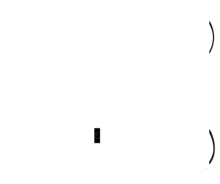
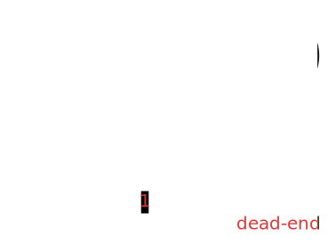
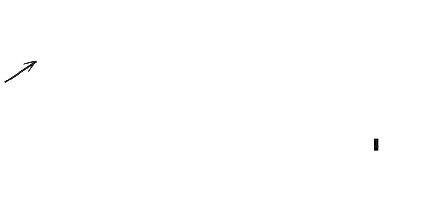

# Nondeterministic Finite Automata (NFA)

## A useful generalization of a DFA

---

# Learning Objectives

By the end of this lecture, you will be able to:

- **Define** what an NFA is and how it differs from a DFA
- **Identify** nondeterministic transitions in automata
- **Convert** between NFAs and DFAs
- **Implement** NFAs in code
- **Recognize** regular languages

---

# What is an NFA?

**Nondeterministic Finite Automata (NFA)**
- A useful generalization of a DFA
- Allows more flexible state transitions
- Makes some automata simpler to design

**Key Question:** Does this added flexibility make NFAs more powerful than DFAs?

---

# NFA Enhancement #1
## Multiple Transitions on Same Symbol

A state can have transitions to **multiple states** on the same symbol

<div class='cols'><div>


</div><div>

When reading '1' from state q1:
- Can go to q2 OR
- Can go to q3

</div></div>

---

# NFA Enhancement #2
## Null Transitions (ε-transitions)

A state can transition without reading any symbol

<div class='cols'><div>



</div><div>

From q1, can spontaneously move to q2 or q3 without consuming input

</div></div>

---

# NFA Enhancement #3
## Missing Transitions

A state can have **no transitions** for some symbols (dead ends)

<div class='cols'><div>



</div><div>

No transition defined for '1' from q1
- If '1' is read, this path dies

</div></div>

---

# How to Run an NFA?

**The Nondeterministic Approach:**

1. **Follow all possible paths** simultaneously
2. If **any path** leads to an accept state → **ACCEPT**
3. If **all paths** fail → **REJECT**

Think of it as:
- Exploring multiple parallel universes
- Success in any universe = overall success

---

# Example 1: Strings Ending in "1"

**Language:** Binary strings ending in "1"

<div class='cols'><div>

## DFA Version


</div><div>

## NFA Version (Simpler!)


</div></div>

---

# Example 1: Trace 

<div class='cols'><div>


</div><div>

Trace of "011":


</div></div>

---

# Example 2: Strings Ending in "1" OR "10"


---

# Example 3a: Strings that repeat "10" zero or more times


---

# Example 3b: Strings that repeat "10" one or more times


---

# 🎯 Active Learning: NFA Design

Alphabet: {0, 1, ..., 9}
Language: Whole numbers divisible by 5

1. Design an NFA that recognizes the above language
2. Trace sample inputs "25", "20", "21"

---

# 🎯 Active Learning: NFA Design Solution


---

# The Big Question

## Does nondeterminism make NFAs more powerful than DFAs?

🤔 Think about it...

Can NFAs recognize languages that DFAs cannot?

---

# The Surprising Answer

## **NO!**

> **An NFA is equivalent to a DFA**

Every NFA can be converted to an equivalent DFA!

But how? 🤯

---

# NFA to DFA Conversion: The Idea

**Subset Construction:**

- If NFA has N states
  - There are 2^N possible subsets of states
- Each subset becomes a DFA state

**Example:** NFA with 3 states {q1, q2, q3}
- DFA states: {}, {q1}, {q2}, {q3}, {q1,q2}, {q1,q3}, {q2,q3}, {q1,q2,q3}

---

# Conversion Example: Building the Table


Let's convert this NFA to a DFA...

---

# DFA State Transition Table

| DFA State   | 0           | 1              |
| ----------- | ----------- | -------------- |
| **{q1}**    | {q1}        | **{q1,q2}**    |
| **{q1,q2}** | **{q1,q3}** | **{q1,q2,q3}** |
| **{q1,q3}** | **{q1,q4}** | **{q1,q2,q4}** |
| **{q1,q4}** | {q1}        | {q1,q2}        |

(Partial table shown - 8 more rows needed for complete DFA)

---

# The Resulting DFA



**Which looks simpler to you?** 🤔

---

# Implementing NFAs in Java

## Key Differences from DFA

```java
public class NFA {
  public static class State {
    // Symbol can be NULL ('\0')!
    void addTransition(Character symbol, State to) {...}
    
    // Returns SET of states, not single state!
    Set<State> getTransition(Character symbol) {...}
  }
  
  // 1. Set current state to the start state
  // 2. Find all null-closure states i.e. reachable from the current state via null transitions
  // 3. If the input is exhausted, return whether any null-closure state is accept
  // 3. For each null-closure state, read the next symbol and the set of next states
  // 4. For each next state, set it as the current state and repeat from step 2 (recursion helps)
  public boolean accepts(String input) {...}
}
```

---

# Regular Languages

## Definition

> A formal language is called a **regular language** if some DFA **or NFA** recognizes it.

**Key insight:** Since DFA ≡ NFA
- Language regular if DFA recognizes it
- Language regular if NFA recognizes it
- Same expressive power!

---

# Why Use NFAs Then?

If NFAs = DFAs in power, why bother?

## Advantages of NFAs:
- **Simpler** to design
- **Fewer states** needed
- **More intuitive** for certain patterns
- **Easier** to combine (union, concatenation)

## Trade-off:
- Harder to implement/simulate

---

# Key Takeaways

1. NFAs add two types of nondeterminism:
   1. Multiple transitions per symbol
   2. Epsilon transitions
2. NFAs are equivalent to DFAs in power
3. NFAs often simpler to design but harder to simulate
4. Regular languages = Languages recognized by DFA or NFA

---


