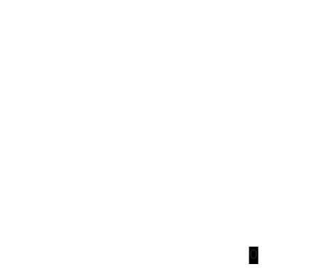

# Nondeterministic Finite Automata (NFA)

- A useful generalization of a DFA
- It enhances state transitions in three ways:
  1. A state can have transitions to **multiple states on the same symbol** being read

    

  2. A state can have transitions to other states without a symbol being read (**null transitions**)

    

  3. A state can have **no transitions for some symbols**. These are effectively dead ends.

    

- How to run such a nondeterministic machine?
  - Follow all possible paths
  - If any path leads to an accept state, accept the string
  - Otherwise reject the string

## Examples

### Example 1

- Automata that accepts binary strings ending in "1"
- DFA

    

- NFA

    

### Example 2

- Automata that accepts binary strings ending in "01"
- DFA

    

- NFA

    

### Example 3


- Where's the nondeterminism?
  - q1 has multiple transitions on the input '1'
    - q1 -> q1
    - q1 -> q2

- What's the language of this NFA?
  - Binary strings that have '1' in the third position from the end 

### Example 4



- Where's the nondeterminism?
  - q1 has null transitions to "even 0s" and q3
- What's the language of this NFA?
  - Binary strings that have an even number of 0s or an odd number of 1s

## NFA vs DFA

- Does non-determinism make the machine more powerful?
  - No!

> **An NFA is equivalent to a DFA**

- How?
  - If the NFA has N states, then there are $2^N$ possible subsets of the N states
    - Each state is either picked or not picked in the subset, leading to 2 possibilities for each of N states
  - So the set of states in each nondeterministic step can be modeled as a deterministic state corresponding to one of the $2^N$ possible subsets

Example 1 NFA as a DFA:


| DFA state transitions | 0            | 1               |
| --------------------- | ------------ | --------------- |
| **q1**                | q1           | **q1,q2**       |
| **q1,q2**             | **q1,q3**    | **q1,q2,q3**    |
| **q1,q3**             | **q1,q4**    | **q1,q2,q4**    |
| **q1,q4**             | q1           | q1,q2           |
| **q1,q2,q3**          | **q1,q3,q4** | **q1,q2,q3,q4** |
| **q1,q2,q4**          | q1,q3        | q1,q2,q3        |
| **q1,q3,q4**          | q1,q4        | q1,q2,q4        |
| **q1,q2,q3,q4**       | q1,q3,q4     | q1,q2,q3,q4     |


Which one looks simpler to you?

## Virtual NFA

Just like a DFA, an NFA can be constructed and simulated using a Java class with a small modification to the DFA API:

The `getTransition` method in `State` returns a `Set<State>` instead of a single `State`. This facilitates multiple transitions on the same symbol, as well as dead-end symbols (empty set of next states).

Null transitions can be supported by using an explicit null symbol (e.g. '\0') and adding transitions for the null symbol.

```java
public class NFA {
  public static class State {
    void addTransition(Character symbol, State to) {...}
    Set<State> getTransition(Character symbol) {...}
  }
  
  public void setStartState(State state) {...}
  public State getStartState() {...}
  public void addAcceptState(State state) {...}
  public Set<State> getAcceptStates() {...}
  
  public boolean accepts(String input) {...}
}
```

- The implementation of the accept method is slightly more involved for an NFA
  - When processing the ith symbol
    - Before reading the symbol, check whether the rest of the string (including the ith symbol) is recognized when starting at each state that is null-transition reachable from the current state
      - Beware of loops/cycles since the input size is not being reduced
    - After reading the symbol, check whether the rest of the string (excluding the ith symbol) is recognized when starting at each state that is symbol-transition away from the current state
  - A recursive solution is recommended

## Regular Languages

> A formal language is called a **regular language** if some DFA **or NFA** recognizes it.


