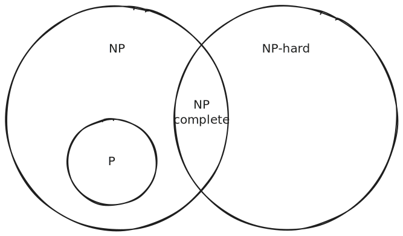

# NP-Completeness

- 1970s: progress in the P vs NP question
  - **All NP problems can reduce to a subset of NP problems in polynomial time**
    -  Problems in that subset are called **NP-complete**
  - So, if you can solve one NP-complete problem in polynomial time, you can solve all NP problems in polynomial time
  - P vs NP now becomes the question: is there a polynomial time algorithm for one NP-complete problem
    - Can focus efforts on NP-complete problems only
    - If we can solve one of them in polynomial time, then P = NP
  - Still an open question
  - Homework problem? 😊

## Polynomial Time Reducibility

- Connection: in [Reduction](reduction.md) we discovered many unsolvable problems by reducing them to the unsolvable halting problem

  > Reduction: convert one problem to another problem such that a solution to the second problem can be used to solve the first problem.

- Now take the efficiency of the reduction into account

- If problem A can reduce to problem B in polynomial time, then it's a **polynomial time reduction**

- This means that if B is in P, then A is also in P

## Cook-Levin Theorem

- 1971 paper first establishing that there exists an NP-complete problem

> Every nondeterministic Turning Machine (i.e. every problem in NP) can be reduced to the boolean satisfiability problem (SAT) in polynomial time

What does this mean?

- For a TM on input $w$ we can construct an expression of boolean variables
- If the TM accepts input $w$, the corresponding boolean expression has a satisfying assignment
- If the corresponding boolean expression has a satisfying assignment, the TM accepts input $w$
- SAT is in NP and every NP problem can be reduced to it in polynomial time
- So SAT is NP-complete

Sketch of the proof:

1. Represent the TM computation on $w$ as a table

   - e.g. table for a TM that decides whether a binary string ends in a 1, on input 101

    

   |            | State    | Tape head | cell 0 | cell 1 | cell 2 | cell 3 |
   | ---------- | -------- | --------- | ------ | ------ | ------ | ------ |
   | **Time 0** | pending1 | cell 0    | **1**  | 0      | 1      | ⊔      |
   | **Time 1** | last1    | cell 1    | 1      | **0**  | 1      | ⊔      |
   | **Time 2** | pending1 | cell 2    | 1      | 0      | **1**  | ⊔      |
   | **Time 3** | last1    | cell 3    | 1      | 0      | 1      | **⊔**  |
   | **Time 4** | accept   | cell 2    | 1      | 0      | **1**  | ⊔      |

2. Encode the table as boolean variables

   1. $Q_{t, q} = 1$ iff at time $t$ the TM is in state $q$
      - $Q_{0,\text{pending1}} = 1, Q_{0, \text{last1}} = 0, Q_{0, \text{accept}} = 0$
      - $Q_{1,\text{pending1}} = 0, Q_{1, \text{last1}} = 1, Q_{1, \text{accept}} = 0$
      - ...
   2. $H_{t,c} = 1$ iff at time $t$ the tape head is at cell $c$
      - $H_{0,0} = 1, H_{0,1} = 0, H_{0,2} = 0, H_{0, 3} = 0$
      - $H_{1,0} = 0, H_{1,1} = 1, H_{1,2} = 0, H_{1, 3} = 0$
      - ...
   3. $S_{t,c,s} = 1$ iff at time $t$ the symbol at cell $c$ is $s$
      - $S_{0,0,0} = 0, S_{0,0,1} = 1, S_{0,0,⊔} = 0$
      - $S_{0,1,0} = 1, S_{0,1,1} = 0, S_{0,1,⊔} = 0$
      - ...

3. Write boolean expressions for the computational constraints:

   1. Initial configuration
      - $e_\text{start} = Q_{0,\text{pending1}} \land H_{0,0} \land S_{0,0,1} \land S_{0,1,0} \land S_{0,2,1} \land S_{0,3,⊔}$
   2. Accepting configuration
      - $e_a = Q_{4,\text{accept}}$
   3. Valid transitions
      - Time 0 to 1: $e_\text{0 -> 1} = (Q_{0,\text{pending1}} \land H_{0,0} \land S_{0,0,1}) \rightarrow (Q_{1,\text{last1}} \land H_{1,1} \land S_{1,0,1})$
        - $A \rightarrow B$ is equivalent to $\neg A \lor B$
          - "If it's raining then I carry an umbrella" is equivalent to "It's not raining or I'm carrying an umbrella"
        - So $e_\text{0 -> 1} = \neg(Q_{0,\text{pending1}} \land H_{0,0} \land S_{0,0,1}) \lor (Q_{1,\text{last1}} \land H_{1,1} \land S_{1,0,1})$
      - Time 1 to 2: ...
      - ...
      - So, $e_\text{move} = e_\text{0 -> 1} \land e_\text{1 -> 2} \land ...$
   4. At any time, one symbol per cell, one state, one tape head position
      - $e_\text{cell} = ...$ a long but conceptually simple expression which we'll skip because it's not all that insightful

4. Write an overall boolean expression combining the constraints:

   - $e =e_\text{start} \land e_\text{move} \land e_\text{accept} \land e_\text{cell}$
   - $e$ is satisfiable if and only if there's a valid computation history of the TM that accepts the input $w$

## Karp's 21 NP-Complete Problems

- Karp's 1972 paper expanded the list of NP-complete problems to include a wide range of practical problems
  - Chain of polynomial time reductions, starting from SAT

- Here's the list (generated using Gemini 2.5 Pro)

| #   | Problem Name                     | Brief Description                                                                                                                            |
| --- | -------------------------------- | -------------------------------------------------------------------------------------------------------------------------------------------- |
| 1   | **Satisfiability (SAT)**         | (Starting Point) Given a Boolean formula, is there a satisfying truth assignment?                                                            |
| 2   | **0-1 Integer Programming**      | Given an integer matrix (A) and vector (b), is there a 0-1 vector (x) such that $Ax \leq b$?                                                 |
| 3   | **Clique**                       | Does a graph (G) have a clique of size at least (k)?                                                                                         |
| 4   | **Set Packing**                  | Given a collection of finite sets, can you choose (k) of them that are pairwise disjoint?                                                    |
| 5   | **Vertex Cover**                 | Does a graph have a set of (k) vertices such that every edge is incident to at least one vertex in the set?                                  |
| 6   | **Set Covering**                 | Given a collection of subsets of a universe (U), can you find (k) subsets whose union is (U)?                                                |
| 7   | **Feedback Node Set**            | In a directed graph, is there a set of (k) vertices whose removal makes the graph acyclic?                                                   |
| 8   | **Feedback Arc Set**             | In a directed graph, is there a set of (k) edges (arcs) whose removal makes the graph acyclic?                                               |
| 9   | **Directed Hamiltonian Cycle**   | Does a directed graph contain a simple cycle that visits every vertex exactly once?                                                          |
| 10  | **Undirected Hamiltonian Cycle** | Does an undirected graph contain a simple cycle that visits every vertex exactly once?                                                       |
| 11  | **3-Satisfiability (3-SAT)**     | Given a Boolean formula in 3-CNF, is it satisfiable?                                                                                         |
| 12  | **Chromatic Number**             | Can the vertices of a graph be colored with (k) colors so that no two adjacent vertices share the same color?                                |
| 13  | **Clique Cover**                 | Can the vertices of a graph be partitioned into (k) cliques?                                                                                 |
| 14  | **Exact Cover**                  | Given a collection of subsets of a universe (U), is there a subcollection whose union is (U) and whose members are pairwise disjoint?        |
| 15  | **Hitting Set**                  | Given a collection of subsets, what is the smallest set that has a non-empty intersection with each subset?                                  |
| 16  | **Steiner Tree**                 | In a graph with some "terminal" vertices, what is the minimum-weight subgraph that connects all terminals?                                   |
| 17  | **3-Dimensional Matching**       | Given three sets (X, Y, Z) of equal size, and a set of triples ⁠(x, y, z), can you find a set of (                                           |
| 18  | **Knapsack**                     | Given a set of items with weights and values, can you select items that fit in a knapsack of a certain capacity and achieve a certain value? |
| 19  | **Job Sequencing**               | Can a set of jobs, each with a deadline and a penalty for being late, be scheduled to keep the total penalty below a certain threshold?      |
| 20  | **Partition**                    | Can a set of integers be partitioned into two subsets with an equal sum?                                                                     |
| 21  | **Max Cut**                      | Can the vertices of a graph be partitioned into two sets (S) and (T) such that at least (k) edges cross from (S) to (T)?                     |

## Summary

- **P**: Problems solvable in polynomial time by a deterministic Turing machine
- **NP**: Problems verifiable in polynomial time by a deterministic Turing machine or solvable in polynomial time by a nondeterministic Turing machine
  - P is a subset of NP
  - Open question whether P = NP
- **NP-complete**: The “hardest” problems in NP
  - If any NP-complete problem can be solved in polynomial time, all NP problems can be (and then P will be equal to NP)
  - No such solution has been found as yet
- **NP-hard**: At least as hard as NP-complete, but **not necessarily in NP**
  - e.g. undecidable problems like the halting problem

---