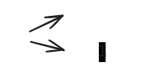
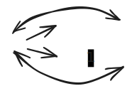
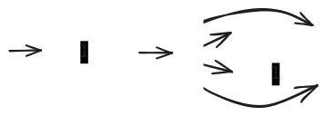
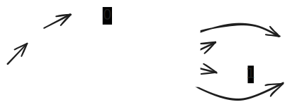

# Regular Expression Evaluation

Converting REs to NFAs for Pattern Matching

---

## Motivating Question

**How would you implement your own `grep`?**

- If an RE specifies a regular language, and an NFA recognizes it...
- We need a way to **convert an RE to an NFA** to implement RE matching
- But how do we do this systematically?

---

## RE → NFA: The Approach

**Key Idea:** Evaluate an RE by treating it as an expression

- **Operands** are NFAs corresponding to sub-expressions
- **Operators** act on the NFAs to produce new NFAs

Analogous to an arithmetic expression like $1 + (4-1) \times 2$
    - operands are numbers (1, 4, 2, ...)
    - operators are arithmetic ops (+, -, $\times$, ...)

---

## Postfix Notation

**Challenge:** Expression evaluation is more convenient when the expression is in **postfix notation** (rather than the usual infix notation)

**Postfix: Operator comes after its operands**

**Example:**

$\underbrace{1 + (4-1) \times 2}_\text{infix} \iff \underbrace{1\;4\;1\;-\;2\;*\;+}_\text{postfix}$

---

## Why Postfix?

1. **Removes complexity** of operator precedence
   - No need for parentheses to override precedence
   
2. **Easier to write code** to evaluate
   - Simple stack-based algorithm
   - No need to handle precedence rules in code

---

## Infix vs Postfix: Examples

<div class='cols'><div>

| Arithmetic (infix)  | Arithmetic (postfix) |
| :------------------ | :------------------- |
| 11                  | 11                   |
| 11 + 3              | 11 3 +               |
| 11 - 3              | 11 3 -               |
| (11 + 3) $\times$ 2 | 11 3 + 2 $\times$    |
| 11 + 3 $\times$ 2   | 11 3 2 $\times$ +    |
| 11 + 3 - 2 $\div$ 4 | 11 3 + 2 4 $\div$ -  |

</div><div>

| RE (infix)     | RE (postfix) |
| :------------- | :----------- |
| 0              | 0            |
| 1              | 1            |
| 0\|1           | 01\|         |
| (0\|1).(0\|1)  | 01\|01\|.    |
| (0\|1)*        | 01\|*        |
| 0\|(1.(0\|1)*) | 101\|*.0\|   |

Note: `.` here is an explicit concatenation operator, not an extended regular expression symbol

</div></div>

---

<!-- _class: compact -->

## Postfix Evaluation Algorithm

<div class='cols'><div>

1. **While** the expression has tokens left:
   1. Read next token (operand or operator)
   2. **If operand:** push to stack
   3. **If operator:**
      1. Pop the required number of operands from stack
      2. Operate on the popped operands
      3. Push the result to stack
2. **If** the stack has a single operand:
   1. Pop and return it as the result
3. **Otherwise:** The expression was malformed

</div><div>

**Evaluate:** `1 4 1 - 2 * +` (equivalent to $1 + (4 - 1) \times 2$)

| Token              | Stack (rightmost is top) |
| :----------------- | :----------------------- |
| **1** 4 1 - 2 * +  | 1                        |
| 1 **4** 1 - 2 * +  | 1, 4                     |
| 1 4 **1** - 2 * +  | 1, 4, 1                  |
| 1 4 1 **-** 2 * +  | 1, 3                     |
| 1 4 1 - **2** * +  | 1, 3, 2                  |
| 1 4 1 - 2 **\*** + | 1, 6                     |
| 1 4 1 - 2 * **+**  | 7                        |

</div></div>

---

## RE Postfix Evaluation

**Same algorithm, but:**
- **Operands** are NFAs for individual symbols
- **Operators** are NFA operations (union `|`, concatenation `.`, Kleene star `*`)

**Example:** Evaluate `101|*.0|`

This represents the RE: `0|(1.(0|1)*)`

---

## RE Example: Step-by-Step (1/3)

**Evaluate:** `101|*.0|`

| Token          | Stack                                                                                                                         |
| :------------- | :---------------------------------------------------------------------------------------------------------------------------- |
| **1**01\|*.0\| |                                                                                      |
| 1**0**1\|*.0\| |                                             |
| 10**1**\|*.0\| |    |

---

## RE Example: Step-by-Step (2/3)

| Token            | Stack                                                                               |
| :--------------- | :---------------------------------------------------------------------------------- |
| 101 **\|** *.0\| |   |
| 101\| **\***.0\| |   |
| 101\|* **.** 0\| |                                            |

---

## RE Example: Step-by-Step (3/3)

| Token           | Stack                                                                               |
| :-------------- | :---------------------------------------------------------------------------------- |
| 101\|*.**0**\|  |   |
| 101\|*.0 **\|** |                                            |

**Result:** Final NFA that recognizes the language of the original RE!

---

## 🎯 Active Learning Activity

**Practice:** Convert to postfix and trace the evaluation

1. RE (infix): `(a|b)*c`
   - What is the postfix form?
   - Trace the first 3 steps of evaluation

2. RE (infix): `a(b|c)*`
   - What is the postfix form?
   - What does this language accept?

---

## Implementation: Generic Postfix Evaluation 

1. Operands of type `T`
   - e.g. `Double` for arithmetic expressions
   - e.g. `NFA` for regular expressions
2. Operand creator of type `Function<String, T>`
   - Converts a `String` symbol for an operand into an operand of type `T`
   - e.g. arithmetic: `s -> Double.parseDouble(s)` 
   - e.g. RE: `s -> NFAOps.createForSymbol(s.charAt(0))`

---

## Implementation: Generic Postfix Evaluation (contd.)

3. Operators registry of type `Map<String, Consumer<Stack<T>>>`
   - key: operator symbol
   - value: operator implementation
     - pops the appropriate number of operands from the stack, applies the operator on those operands, and pushes the result back on to the stack
   - e.g. arithmetic plus: `"+" ->  s -> s.push(s.pop() + s.pop())`
   - e.g. RE union: `"|" ->  s -> s.push(NFAOps.union(s.pop(), s.pop()))`
  
---

## Implementation: Generic Postfix Evaluation (contd.)

4. `PostfixEvaluator<T>`
   - `T`: operand type (e.g. `Double` or `NFA`)
   - State:
     - `Function<String, T> operandCreator`
     - `Map<String, Consumer<Stack<T>>> operators`
   - Behavior:
     - `T evaluate(String[] expressionTokens) {...}` 
       - implementation: the stack-based postfix evaluation algo
  
---

## Implementation: Arithmetic Postfix Evaluation

```java
Function<String, Double> operandCreator = s -> Double.parseDouble(s);
Map<String, Consumer<Stack<Double>>> operators = Map.of(
    "+", s -> s.push(s.pop() + s.pop()),
    "*", s -> s.push(s.pop() * s.pop()),
    ...
);
PostfixEvaluator<Double> arithmeticPostfixEvaluator = new PostfixEvaluator<>(operandCreator, operators);
double result = arithmeticPostfixEvaluator.evaluate("1 4 1 - 2 * +".split(" "));
```

---

## Implementation: RE Postfix Evaluation

```java
Function<String, NFA> operandCreator = s -> NFAOps.createForSymbol(s.charAt(0));
Map<String, Consumer<Stack<NFA>>> operators = Map.of(
    "|", s -> s.push(NFAOps.union(s.pop(), s.pop())),
    ...
);
PostfixEvaluator<NFA> regularPostfixEvaluator = new PostfixEvaluator<>(operandCreator, operators);
NFA nfa = regularPostfixEvaluator.evaluate("101|*.0|".split(""));
bool accepts = nfa.accepts("101");
```

---

## Summary

1. **RE → NFA** conversion enables RE matching implementation
2. **Postfix notation** simplifies expression evaluation
3. **Stack-based algorithm** evaluates postfix expressions
4. **Generic design** allows reuse (arithmetic, NFAs, etc.)

**Next:** You can now implement your own `grep`! 🎉

---


