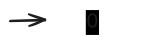
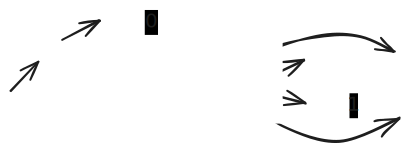

# RE Evaluation

- How would you implement your own grep?
- If an RE specifies a regular language, and an NFA recognizes it, we need a way to convert an RE to an NFA to be able to implement RE matching
- How?

## RE -> NFA

- By evaluating an RE:
  - operands are NFAs corresponding to sub expressions
  - operators act on the NFAs
- Expression evaluation is more conveniently done when the expression is in a postfix notation (as opposed to the usual infix notation)

### Postfix Notation

- Operator is after its operands
  - e.g. $\underbrace{1 + (4-1)*2}_\text{infix} \iff \underbrace{1\;4\;1 - 2 * +}_\text{postfix}$
- Why?
  1. Removes complexity of operator precedence and the need to use parenthesis to override the precedence
  2. Easier to write code to evaluate

| RE (infix)     | RE (postfix) |
| -------------- | ------------ |
| 0              | 0            |
| 1              | 1            |
| 0\|1           | 01\|         |
| (0\|1).(0\|1)  | 01\|01\|.    |
| (0\|1)*        | 01\|*        |
| 0\|(1.(0\|1)*) | 101\|*.0\|   |

### Postfix Evaluation

How to evaluate a postfix expression:

1. While the expression has tokens left
   1. Read next token (operand or operator)
   2. If operand:
      1. push to stack
   3. If operator:
      1. pop the required number of operands from the stack (e.g. 2 for a binary operator)
      2. operate on the popped operands
      3. push the result to stack
2. If the stack has a single operand:
   1. Pop and return it as the result
3. Otherwise:
   1. The expression was malformed

Example with a postfix arithmetic expression: **1 4 1 - 2 * +**

| Token              | Stack (rightmost is top) |
| ------------------ | ------------------------ |
| **1** 4 1 - 2 * +  | 1                        |
| 1 **4** 1 - 2 * +  | 1, 4                     |
| 1 4 **1** - 2 * +  | 1, 4, 1                  |
| 1 4 1 **-** 2 * +  | 1, 3                     |
| 1 4 1 - **2** * +  | 1, 3, 2                  |
| 1 4 1 - 2 **\*** + | 1, 6                     |
| 1 4 1 - 2 * **+**  | 7                        |

Example with a postfix RE: **101|*.0|**

| Token            | Stack (rightmost is top)                                                                                                                                                                                                                  |
| ---------------- | ----------------------------------------------------------------------------------------------------------------------------------------------------------------------------------------------------------------------------------------- |
| **1**01\|*.0\|   |                                                                                                                                                              |
| 1**0**1\|*.0\|   |                                                                                 |
| 10**1**\|*.0\|   |    |
| 101 **\|** *.0\| |                                                                                 |
| 101\| **\***.0\| |                                                                                 |
| 101\|* **.** 0\| |                                                                                                                                                              |
| 101\|*.**0**\|   |                                                                                 |
| 101\|*.0 **\|**  |                                                                                                                                                              |

## Implementation Structure

```java
// As seen before.
public class NFA {
   ...
}
```

```java
// As seen before
public class NFAOps {
   ...
}
```

```java
// T is the operand type
public class Operators<T> {
   // e.g. add("+", it -> it.next() + it.next())
   public void add(String symbol, Function<Iterator<T>, T> function) {...}
   public Function<Iterator<T>, T> get(String symbol) {...}
}
```

```java
public class PostfixEvaluator<T> {
   public PostfixEvaluator(Operators<T> operators,
            Function<String, T> operandCreator, String[] expressionTokens) {...}

   public T evaluate() {...}
}
```

```java
public class REMatcher {
    public REMatcher(String re) {
      ...
      PostfixEvaluator<NFA> evaluator = ...
      this.nfa = evaluator.evaluate();
    }

    public boolean accepts(String input) {
        return nfa.accepts(input);
    }

    private final NFA nfa;
}
```

