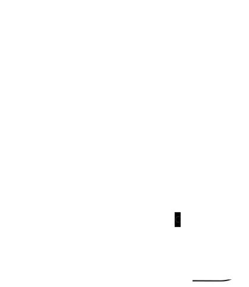
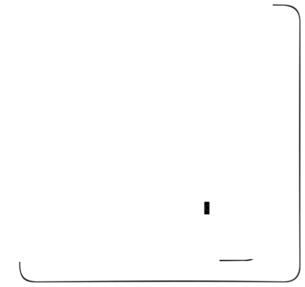
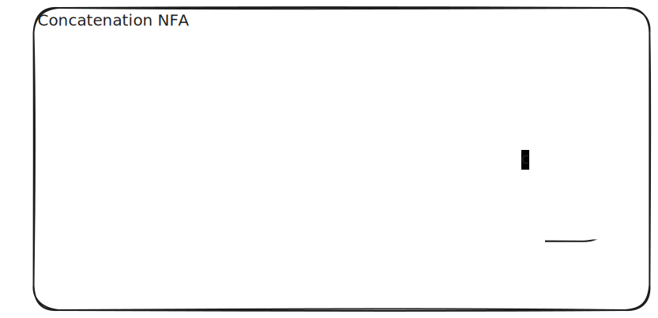
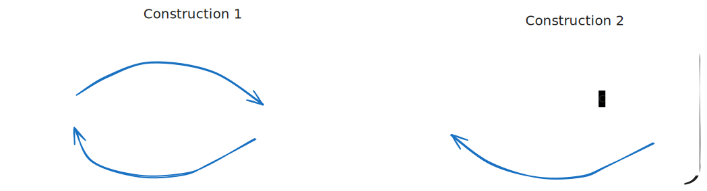

# Operations on Regular Languages

- **Key Insight**: Regular languages are closed under fundamental operations
- **What this means**: Applying these operations to regular languages always produces regular languages
- **Today's Focus**: Three core operations and their constructions

---

## The Three Core Operations

1. **Union** ($\cup$)
2. **Concatenation** (implicit or .)
3. **Closure** (*)

Each operation has:
- A formal definition
- Proof of closure (constructive proof using NFAs)
- Implementation strategy for virtual NFAs

---

## 1. Union Operation

### Definition
The **union** of two regular languages is a regular language of all strings that belong to at least one of the languages.

$$R_1 \cup R_2 = R_\cup = \{ w \mid w \in R_1 \text{ or } w \in R_2 \}$$

### Example
- $R_1 = \{ab, bc\}$
- $R_2 = \{bc, ac\}$
- $R_1 \cup R_2 = \{ab, bc, ac\}$

---

## Union: Proof by Construction

<div class='cols'><div>



</div><div>



</div></div>

---

## 2. Concatenation Operation

### Definition
The **concatenation** of two regular languages $R_1$ and $R_2$ is the regular language of all strings formed by concatenating a string from $R_1$ with a string from $R_2$.

$$R_1 R_2 = R_\text{concat} = \{ xy \mid x \in R_1 \text{ and } y \in R_2 \}$$

### Example
- $R_1 = \{ab, bc\}$
- $R_2 = \{bc, ac\}$
- $R_1 R_2 = \{abbc, abac, bcbc, bcac\}$

---

## Concatenation: Proof by Construction



---

## 3. Closure Operation

### Definition
The **closure** (or Kleene star) of a regular language $R$ is a regular language of all strings formed by concatenating zero or more strings from $R$.

$$R^* = \{ w_1 w_2 \cdots w_k \mid k \geq 0, w_i \in R \}$$

Note: $\varepsilon \in R^*$ (concatenating zero strings)

### Example
- $R = \{ab, bc\}$
- $R^* = \{\varepsilon, ab, bc, abab, abbc, bcab, bcbc, \ldots\}$

---

## Closure: Proof by Construction



---

## Active Learning: Identify the Operation

$L_1 = \{0, 1\}$ i.e. the language of 1 digit binary numbers

1. $L_1 \cup L_1$ = ?
2. $L_1 L_1$ = ?
3. $L_1*$ = ?

---

## Implementing Union in Virtual NFA

```java
public static NFA union(NFA n1, NFA n2) {
    NFA union = new NFA();

    // Create a new start state.
    ...
    
    // Add ε-transition from the new start state to each NFA's start state
    ...
    
    // Add each NFA's accept states to the union accept states
    ...
    
    return union;
}
```

---

## Implementing Concatenation in Virtual NFA

```java
public static NFA concatenation(NFA n1, NFA n2) {
    NFA concat = new NFA();
    
    // Start state is n1's start state
    ...
    
    // Add ε-transitions from n1's accept states to n2's start
    ...
    
    // Accept states are n2's accept states
    ...
    
    return concat;
}
```

---

## Implementing Closure in Virtual NFA

```java
public static NFA closure(NFA n) {
    NFA star = new NFA();

    // Create a new start state.
    ...
    
    // New start is an accept state (accept ε)
    ...
    
    // ε-transition to original start
    ...
    
    // ε-transitions from accept states back to original start
    ...
    
    return star;
}
```

---

## Key Takeaways

| Operation     | Symbol       | Meaning                              | Property |
| ------------- | ------------ | ------------------------------------ | -------- |
| Union         | $\cup$       | Strings in either language           | Closed   |
| Concatenation | . (implicit) | Prefix from $R_1$, suffix from $R_2$ | Closed   |
| Closure       | *            | Zero or more repetitions             | Closed   |

**Main Point**: These constructions show that regular languages form a **closed system** under these operations.

---

## Application: Building Complex Languages

You can combine these operations to build sophisticated regular languages:

- $(a \cup b)^*$: Any string of a's and b's
- $ab(cd)^*$: "ab" followed by zero or more "cd"
- $(a^* b a^*)^*$: Complex patterns with a's and b's

Understanding these operations is crucial for:
- Regular expression design
- Compiler lexical analysis
- String pattern matching

---

