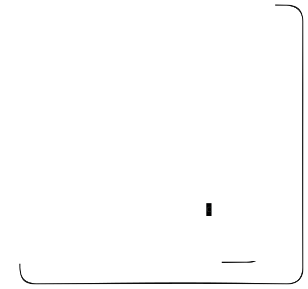
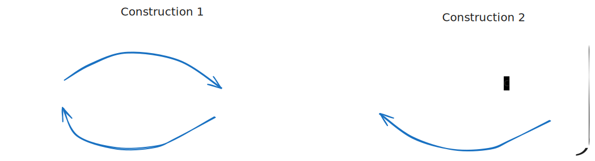

# Operations on Regular Languages

There are three core operations on regular languages (and equivalently on NFAs and DFAs).

## 1. Union

> The **union** of two regular languages is a regular language

- Symbol: $\cup$
- Union as in the set of all unique strings that are in at least one of the languages
  - e.g. $R_1 = \{ ab, bc \}, R_2 = \{ bc, ac \}, R_1 \cup R_2 = \{ab, bc, ac\}$
- Proof
  - Given $\text{NFA}_1, \text{NFA}_2$
  - Can construct $\text{NFA}_\cup$

   

   

## 2. Concatenation

> The **concatenation** of two regular languages is a regular language

- Symbol: implicit (or .)
- Concatenation means all unique strings with the prefix from $R_1$ and suffix from $R_2$ 
  - e.g. $R_1 = \{ ab, bc \}, R_2 = \{ bc, ac \}, R_1 R_2 = \{abbc, abac, bcbc, bcac \}$
- Proof
  - Given $\text{NFA}_1, \text{NFA}_2$
  - Can construct $\text{NFA}_{1.2}$

   

## 3. Closure

> The **closure** of a regular language is a regular language

- Symbol: *
- Closure means concatenating strings in the language with strings in the language 0, 1, or more times
  - e.g. $R = \{ ab, bc \}, R* = \{ \epsilon, ab, bc, abab, abbc, bcab, bcbc, ... \}$
- Proof
  - Given $\text{NFA}$
  - Can construct $\text{NFA}*$

   

   

## Virtual NFA Operations

- Given a virtual NFA API, we can construct virtual NFAs for the union, concatenation, and closure operators following the construction strategy described above 

```java
public class NFAOps {

    public static NFA union(NFA n1, NFA n2) {
        // Create an NFA with a new start state.
        NFA union = new NFA();
        ...
                
        // Add null transitions from the start state to the start states of n1, n2.
        start.addTransition('\0', n1.getStartState());
        ...

        // Set the accept states of n1 and n2 as the accept states of the union.
        for (State state : n1.getAcceptStates()) {
            union.addAcceptState(state);
        }
        ...

        return union;
    }

    public static NFA concatenation(NFA n1, NFA n2) {...}

    public static NFA closure(NFA n) {...}
}
```

