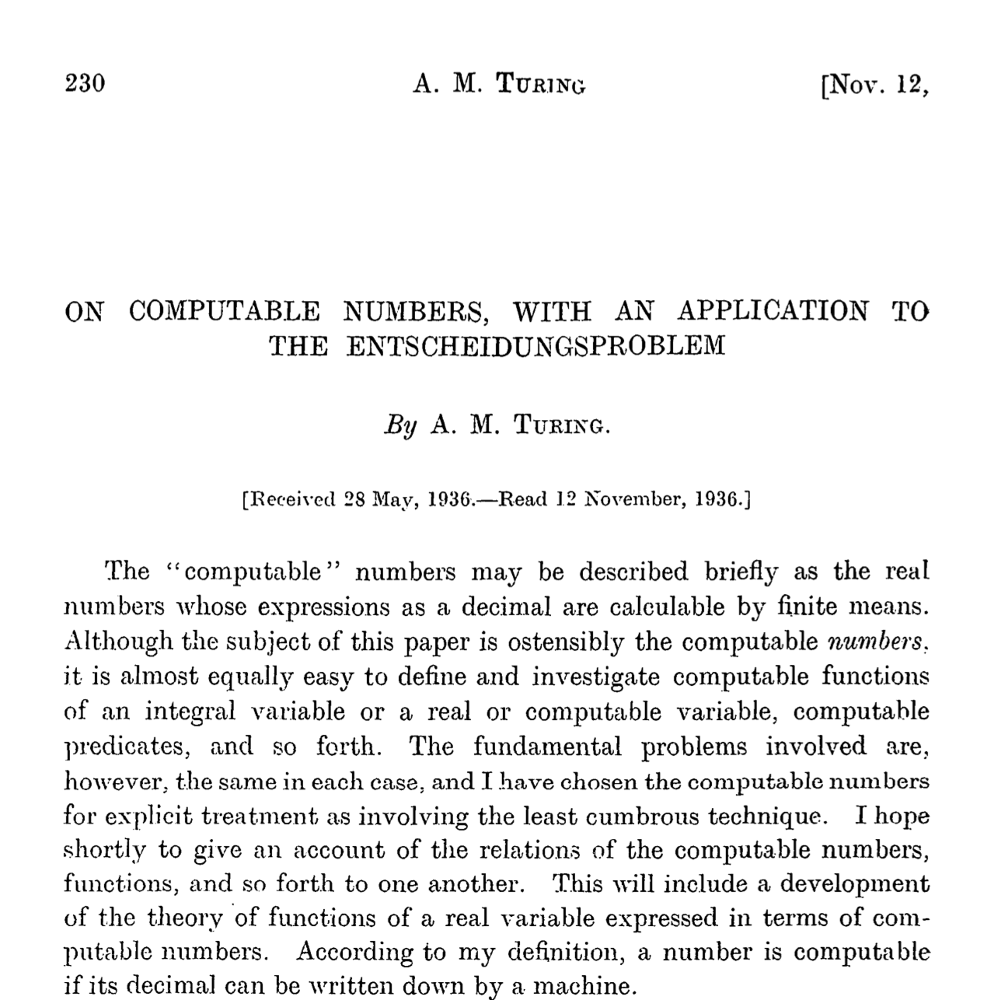
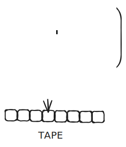
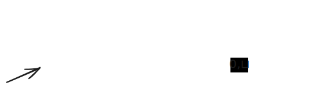
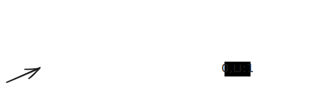
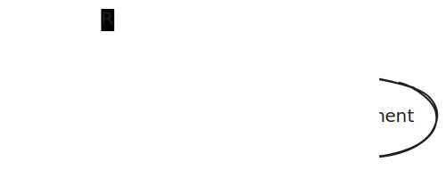
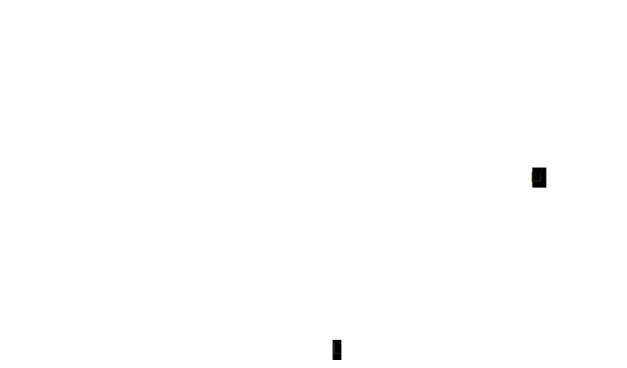

<!-- _class: lead -->

# Turing Machines

## The Ultimate Computational Model

---

# The Foundation of Computer Science



**Alan Turing's 1936 paper:** "On Computable Numbers, with an Application to the Entscheidungsproblem"

This single paper laid the foundation for modern computer science

---

# Learning Objectives

By the end of this lecture, you will be able to:

- **Define** what a Turing Machine is and how it works
- **Trace** TM execution on sample inputs
- **Design** simple TMs for basic computations
- **Understand** why TMs are the theoretical model of computation
- **Implement** virtual TMs in Java

---

# Recall: Finite Automata Limitations

**DFAs and NFAs:**
- Fixed, finite memory (states)
- Can only read input left-to-right once
- Cannot write or modify input

**Cannot recognize:** $0^n1^n$ and other non-regular languages

**We need something more powerful...**

---

# The Turing Machine Model

**Only slightly more complex than DFAs, but a lot more powerful!**

<div class='cols'><div>

Three key enhancements to DFAs:

1. **Enhanced Tape**
2. **Reject States**
3. **Halting Behavior**

</div><div>



</div></div>

---

# Enhancement 1: The Tape

<div class='cols'><div>

### Capabilities:
- **Move both left and right**
- **Read and write** symbols
- **Infinite** in both directions
- Special blank symbol: ⊔

</div><div>

### State Transitions Include:
- Input symbol read
- Output symbol to write
- Direction: L or R

Example: `0:1,R`
- Read 0, write 1, move Right

</div></div>

---

# Enhancement 2: Reject States

**DFAs:** Only accept states (implicit rejection)

**TMs:** Explicit accept AND reject states
- Needed because TMs can run indefinitely
- Must explicitly specify rejection

---

# Enhancement 3: Halting

When a TM reaches an **accept** or **reject** state:
- It **stops immediately**
- No further processing

This defines the computational output

---

# TM State Diagram Notation

**Transition format:** `input:output,direction`

**Example:** `0:0,R`
- Read: 0
- Write: 0
- Move: Right

**Shorthand:** 
- Unlabeled input → any other symbol e.g. `:1,L`
- Unlabeled output → same as input e.g. `1:L`
- No transition defined → reject

---

# Example: DFA as TM

**Language of binary strings ending in 1**
<div class='cols'><div>

**DFA**


</div><div>

**TM**


</div></div>

---

# TM Shorthand

<div class='cols'><div>

**TM 1**


</div><div>

**TM 2**


</div></div>

---

# Example w/ output: Binary Incrementer

<div class='cols'><div>

1. ⊔⊔00⊔⊔
2. ⊔⊔01⊔⊔
3. ⊔⊔10⊔⊔
4. ⊔⊔11⊔⊔
5. ⊔100⊔⊔

</div><div>

Strategy:

1. Scan right to end of input
2. Move left, flipping 1s to 0s
3. When you hit a 0 or ⊔, flip to 1 and stop

</div></div>

---

# Example w/ output: Binary Incrementer

<div class='cols'><div>


</div><div>

Strategy:

1. **Scan right to end of input**
2. Move left, flipping 1s to 0s
3. When you hit a 0 or ⊔, flip to 1 and stop

</div></div>

---

# Example w/ output: Binary Incrementer

<div class='cols'><div>



</div><div>

Strategy:

1. **Scan right to end of input**
2. **Move left, flipping 1s to 0s**
3. When you hit a 0 or ⊔, flip to 1 and stop

</div></div>

---

# Example w/ output: Binary Incrementer

<div class='cols'><div>



</div><div>

Strategy:

1. **Scan right to end of input**
2. **Move left, flipping 1s to 0s**
3. **When you hit a 0 or ⊔, flip to 1 and stop**

</div></div>

---

# Example w/ output: Binary Incrementer

<div class='cols'><div>


Strategy:

1. Scan right to end of input
2. Move left, flipping 1s to 0s
3. When you hit a 0 or ⊔, flip to 1 and stop

</div><div>

**Example trace for 101 ($5_{10}$):**

| State   | Tape Position | Action     |
| :------ | :------------ | :--------- |
| scan    | **1** 0 1 ⊔   | R          |
| scan    | 1 **0** 1 ⊔   | R          |
| scan    | 1 0 **1** ⊔   | R          |
| scan    | 1 0 1 **⊔**   | L, flip 1s |
| flip 1s | 1 0 **1** ⊔   | 0, L       |
| flip 1s | 1 **0** 0 ⊔   | 1, done    |
| done    | 110           | halt       |

</div></div>

---

# 🎯 Active Learning: Trace the Incrementer

**Given input:** `111`

| State | Tape Position | Action |
| :---- | :------------ | :----- |
| scan  | ⊔ **1** 1 1 ⊔ | R      |
| ...   | ...           | ...    |

---

# Active Learning: Trace the Incrementer (soln)

| State   | Tape Position | Action     |
| :------ | :------------ | :--------- |
| scan    | ⊔ **1** 1 1 ⊔ | R          |
| scan    | ...           | R          |
| scan    | ⊔ 1 1 1 **⊔** | L, flip 1s |
| flip 1s | ⊔ 1 1 **1** ⊔ | 0,L        |
| flip 1s | ⊔ 1 **1** 0 ⊔ | 0,L        |
| flip 1s | ⊔ **1** 0 0 ⊔ | 0,L        |
| flip 1s | **⊔** 0 0 0 ⊔ | 1,done     |
| done    | 1 0 0 0 ⊔     | halt       |

---


## Example: Binary Adder

**Input format:** `⊔101+10⊔`, **Output format:** `⊔111⊔` (5 + 2 = 7)

Strategy:
1. Scan right to the end of $n_2$
2. Decrement $n_2$
3. If $n_2$ was all 0s before the decrement (resulting in all 1s after the decrement):
   1. Replace `+111...⊔` with `⊔⊔⊔...`
   2. Accept
4. Scan left to the end of $n_1$
5. Increment $n_1$
6. Repeat from step 1


---

<div class='cols'><div>

1. Scan right to the end of $n_2$


</div><div>



</div></div>

---

<div class='cols'><div>

1. Scan right to the end of $n_2$
2. Decrement $n_2$
3. If $n_2$ was all 0s before the decrement (resulting in all 1s after the decrement):
   1. Replace `+111...⊔` with `⊔⊔⊔...`
   2. Accept

</div><div>


</div></div>

---

<div class='cols'><div>

1. Scan right to the end of $n_2$
2. Decrement $n_2$
3. If $n_2$ was all 0s before the decrement (resulting in all 1s after the decrement):
   1. Replace `+111...⊔` with `⊔⊔⊔...`
   2. Accept
4. Scan left to the end of $n_1$

</div><div>



</div></div>

---

<div class='cols'><div>

1. Scan right to the end of $n_2$
2. Decrement $n_2$
3. If $n_2$ was all 0s before the decrement (resulting in all 1s after the decrement):
   1. Replace `+111...⊔` with `⊔⊔⊔...`
   2. Accept
4. Scan left to the end of $n_1$
5. Increment $n_1$
6. Repeat from step 1

</div><div>


</div></div>

---

<!-- _class: compact -->

# Adder: Trace Example

<div class='cols'><div>

**Input:** `101+10`

| State     | Tape                | Action        |
| :-------- | :------------------ | :------------ |
| find n2   | ⊔ **1** 0 1 + 1 0 ⊔ | R             |
| ...       | ...                 | ...           |
| find n2   | ⊔ 1 0 1 + 1 0 **⊔** | L, decrement  |
| decrement | ⊔ 1 0 1 + 1 **0** ⊔ | 1, L          |
| decrement | ⊔ 1 0 1 + **1** 1 ⊔ | 0, L, find n1 |
| find n1   | ⊔ 1 0 1 **+** 0 1 ⊔ | L, increment  |
| increment | ⊔ 1 0 **1** + 0 1 ⊔ | 0, L          |
| increment | ⊔ 1 **0** 0 + 0 1 ⊔ | 1, R, find n2 |
| find n2   | ⊔ 1 1 **0** + 0 1 ⊔ | R             |
| ...       | ...                 | ...           |
| done      | ⊔ 1 1 1 ⊔           |               |

</div><div>


</div></div>

---

# Implementing TMs in Java

Just as we implemented virtual DFAs and NFAs, we can implement virtual TMs!

**Key differences:**
- The tape structure
  - writes
  - bidirectional
  - infinite
- accept/reject states
- halting

---

# Java Implementation: Tape Class

```java
public class Tape {
  
  public char read() {...}
  public void write(char symbol) {...}
  public void moveLeft() {...}
  public void moveRight() {...}
}
```

---

# Tape: Two-Stack Strategy

<div class='cols'><div>

**Problem:** Tape is infinite

**Solution:** Use two stacks
- **Left stack:** Symbols to the left
- **Right stack:** Symbols to the right
- **Current symbol:** Between them

</div><div>

**Example:** For input `101`

```
Left: []
Current: 1
Right: [0, 1]

After moveRight():
Left: [1]
Current: 0
Right: [1]
```

</div></div>

---

# Java Implementation: Transition Class

```java
public class Transition {
  public enum Direction { L, R }
  
  public Transition(State nextState, 
                    Character writeSymbol, 
                    Direction direction) {
    this.nextState = nextState;
    this.writeSymbol = writeSymbol;
    this.direction = direction;
  }
  
  private final State nextState;
  private final Character writeSymbol;
  private final Direction direction;
}
```

---

# Java Implementation: State Class

```java
public class State {
  public void addTransition(Character inputSymbol, 
                           Transition transition) {
    transitions.put(inputSymbol, transition);
  }
  
  public Transition getTransition(Character inputSymbol) {
    return transitions.get(inputSymbol);
  }
  
  private final Map<Character, Transition> transitions  = new HashMap<>();
}
```

---

# Java Implementation: TM Class

```java
public class TM {
  public TM() {...}
  
  public void setStartState(State state) {...}
  public void addAcceptState(State state) {...}
  public void addRejectState(State state) {...}

  /** Returns final decision (accept/reject) and updates tape contents. */
  public boolean run(Tape tape) {...}
}
```

---

<!-- _class: compact -->

# Why Turing Machines Matter

**Three Fundamental Reasons:**

1. **Theoretical Foundation**
   - Precise model of computation
   - Enables mathematical proofs

2. **Universal Model**
   - Church-Turing Thesis (next lecture)
   - As powerful as any physical computer

3. **Practical Impact**
   - Inspired von Neumann architecture
   - Foundation for compiler theory
   - Basis for computability theory

---

# Key Takeaways

✓ TMs add tape read/write and bidirectional movement to DFAs  
✓ TMs can recognize non-regular languages like $0^n1^n$  
✓ TMs can be implemented in Java using two stacks for the tape   
✓ TMs are the theoretical model for all computation  

---

# Looking Ahead

**Next Topics:**

1. **Church-Turing Thesis** - TMs = maximal computational power
2. **Decidability** - What can TMs compute?
3. **The Halting Problem** - What CAN'T TMs compute?
4. **Complexity Theory** - What's practical vs. impractical?

---
