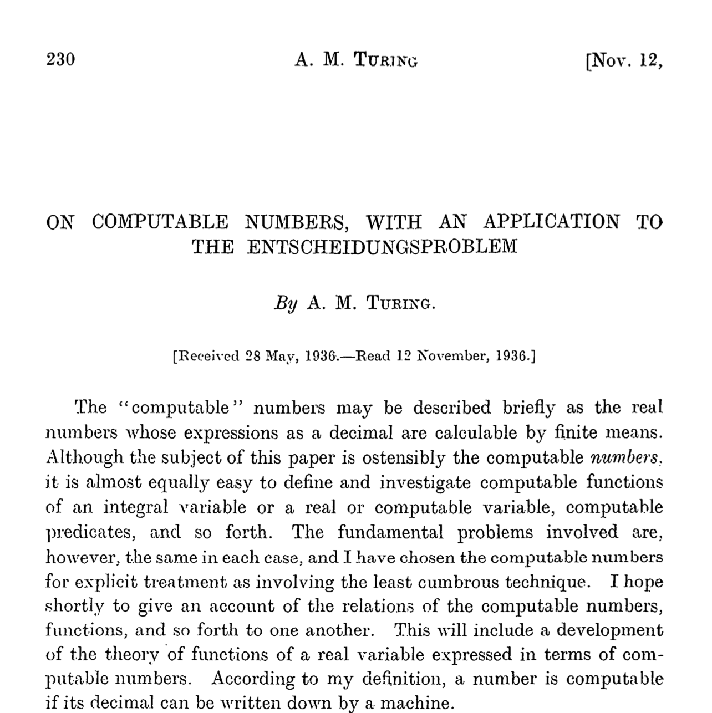

# Turing Machines

- Turing's seminal paper that is the foundation of computer science
  - https://www.cs.virginia.edu/~robins/Turing_Paper_1936.pdf
  
  	

## The Model

- A **Turing Machine (TM)** is only slightly more complicated than the Finite Automata model
- Enhancements to DFAs
  1. Tape
     1. The tape head starts at the beginning of the input and can **move both left and write**, without limits
        - So every state transition includes a 'L', 'R' label to denote whether the tape head should move left or right 
     2. The tape head can **write a symbol**
        - So every state transition includes a symbol to write before moving the tape head
     3. There's a special symbol, say  '&#x2423;', which is assumed to not be in the alphabet and denotes empty tape cells
  2. In addition to *accept* states, there are ***reject* states**
     - DFAs did not need reject states because they only scanned the input once and when the input came to an end at a non-accept state, that was implicitly a rejct
     - TMs however can run forever, either by changing scan direction or by accessing the tape beyond where the input is
  3. If the machine reaches an **accept/reject state, it stops** without any further processing

- There are many variants of a TM and they are all equivalent to one another
  - Nondeterministic
  - Multiple tapes
  - ...
- Every DFA is trivially a TM

## Example: Incrementer

Consider the following TM (state diagram representation) over the binary alphabet:

How do you read the above diagram?

1. Start at state q0
2. Keep scanning the tape right while it reads a 0 or 1
   - "0:0,R" means when you read 0, write 0 and move one cell right
3. When it reads a ⊔ (end of input), move tape head left and transition to state q1
4. Keep scanning the tape left while it reads 1, replacing each 1 by a 0
5. When it reads a 0 or a ⊔, replace with 1 and transition to the accept state q2 (and stop)

Tool: https://www.jflap.org to trace the execution, if you're interested in playing around with TMs

Here's the same diagram with some of the transition labels using a shorthand notation:

- If the input symbol is not written down, it denotes any symbol that does not have an explicitly defined transition
- If the output symbol is not written down, it denotes the same symbol as the input symbol

Trace over the input 101011:

| State | Input       | Output      | Next State |
| ----- | ----------- | ----------- | ---------- |
| q0    | **1**01011  | **1**01011  | q0         |
| q0    | 1**0**1011  | 1**0**1011  | q0         |
| ...   |             |             |            |
| q0    | 101011**⊔** | 101011**⊔** | q1         |
| q1    | 10101**1**  | 10101**0**  | q1         |
| q1    | 1010**1**0  | 1010**0**0  | q1         |
| q1    | 101**0**00  | 101**1**00  | q2         |

What computation does this TM perform?

Increments a binary number by 1

## Example: Adder

Set up example:

1. Input: ...⊔101+10⊔...
2. Output (after accept):  ...⊔111⊔...

Solution strategy:

1. While the 2nd number is not all 0s
   1. Decrement the 2nd number
   2. Increment the 1st number

State diagram:

Trace over the input 101+10:

| State                          | Input        | Output       | Next State |
| ------------------------------ | ------------ | ------------ | ---------- |
| q0                             | ⊔**1**01+10⊔ | ⊔**1**01+10⊔ | q0         |
| ...                            |              |              |            |
| q0                             | ⊔101+10**⊔** | ⊔101+10**⊔** | q1         |
| q1                             | ⊔101+1**0**⊔ | ⊔101+1**1**⊔ | q1         |
| q1                             | ⊔101+**1**1⊔ | ⊔101+**0**1⊔ | q2         |
| q2                             | ⊔101**+**01⊔ | ⊔101**+**01⊔ | q3         |
| q3                             | ⊔10**1**+01⊔ | ⊔10**0**+01⊔ | q3         |
| q3                             | ⊔1**0**0+01⊔ | ⊔1**1**0+01⊔ | q0         |
| ... until 2nd number is all 1s |              |              |            |
| q1                             | ⊔111**+**11⊔ | ⊔111**⊔**11⊔ | q4         |
| q4                             | ⊔111⊔**1**1⊔ | ⊔111⊔**⊔**1⊔ | q4         |
| q4                             | ⊔111⊔⊔**1**⊔ | ⊔111⊔⊔**⊔**⊔ | q4         |
| q4                             | ⊔111⊔⊔⊔**⊔** | ⊔111⊔⊔⊔**⊔** | q5         |

## Example: $0^n1^n$

- TM that recognizes the language $L = \{0^n1^n | n \ge 1\}$
  - Equal number of 0s followed by 1s
  - Connection: we showed earlier how this was not a regular language and so no DFA/NFA could recognize this
- Strategy
  - Mark leftmost `0` with `X`
  - Scan right to find leftmost `1` and mark it with `Y`
  - Scan left to find leftmost `0` and mark it with `X`
  - Repeat until there' no `0` or `1` left
  - Accept if there are no `0` and `1` left
- TM
  - States
    - q0: start state
    - q1: Found `0`, looking for matching `1`
    - q2: Found matching `1`, returning left to the next `0`
    - qa: Accept state
    - qr: Reject state
  - Tape alphabet: `{0, 1, X, Y, ⊔}`
  - Transitions
  
      

  - Example for `0011`

   | State | Input      | Output     | Next State |
   | ----- | ---------- | ---------- | ---------- |
   | q0    | ⊔**0**011⊔ | ⊔**X**011⊔ | q1         |
   | q1    | ⊔X**0**11⊔ | ⊔X**0**11⊔ | q1         |
   | q1    | ⊔X0**1**1⊔ | ⊔X0**Y**1⊔ | q2         |
   | q2    | ⊔X**0**Y1⊔ | ⊔X**0**Y1⊔ | q2         |
   | q2    | ⊔**X**0Y1⊔ | ⊔**X**0Y1⊔ | q0         |
   | q0    | ⊔X**0**Y1⊔ | ⊔X**X**Y1⊔ | q1         |
   | q1    | ⊔XX**Y**1⊔ | ⊔XX**Y**1⊔ | q1         |
   | q1    | ⊔XXY**1**⊔ | ⊔XXY**Y**⊔ | q2         |
   | q2    | ⊔XX**Y**Y⊔ | ⊔XX**Y**Y⊔ | q2         |
   | q2    | ⊔X**X**YY⊔ | ⊔X**X**YY⊔ | q0         |
   | q0    | ⊔XX**Y**Y⊔ | ⊔XX**Y**Y⊔ | q0         |
   | q0    | ⊔XXY**Y**⊔ | ⊔XXY**Y**⊔ | q0         |
   | q0    | ⊔XXYY**⊔** | ⊔XXYY**⊔** | qa         |